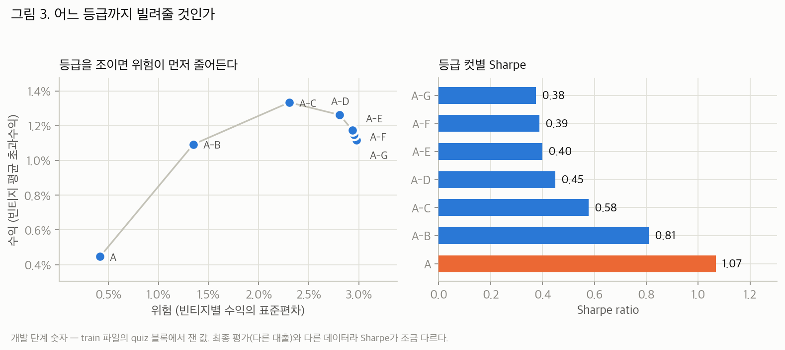
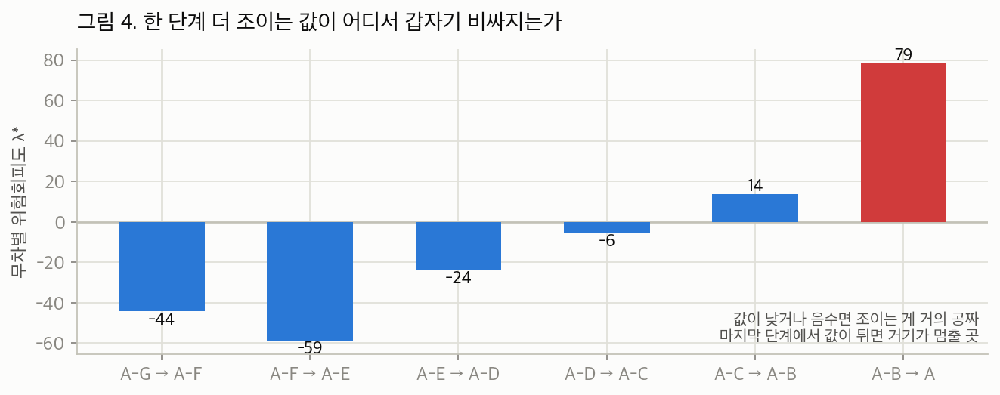
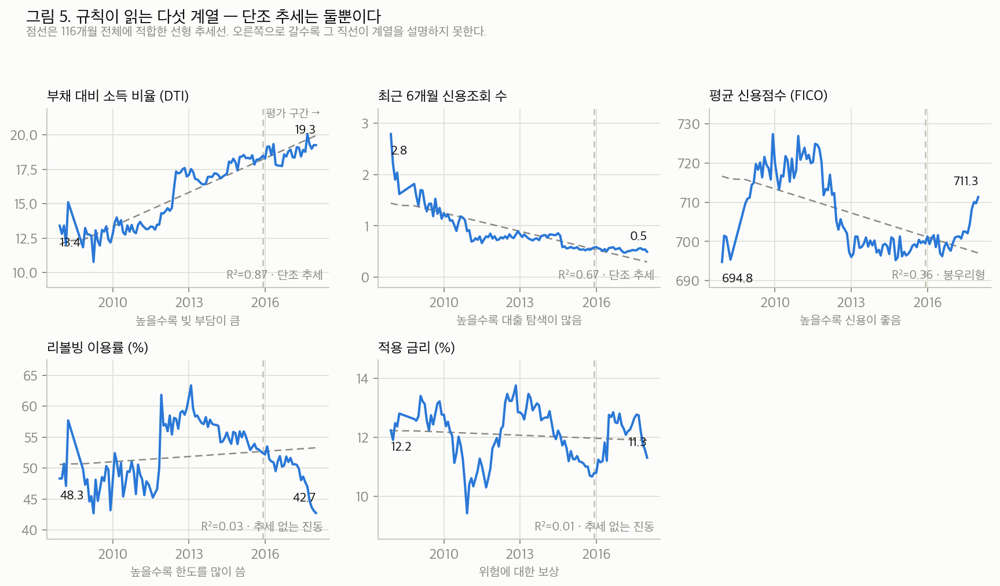
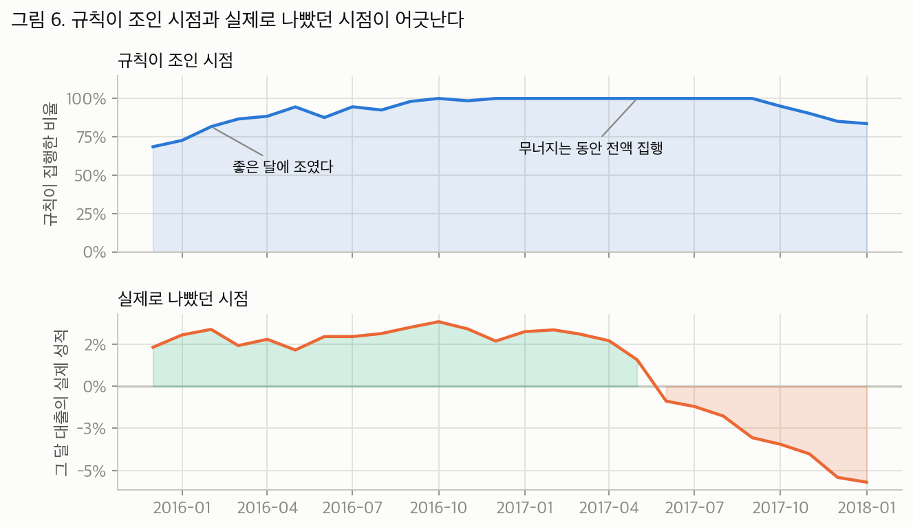
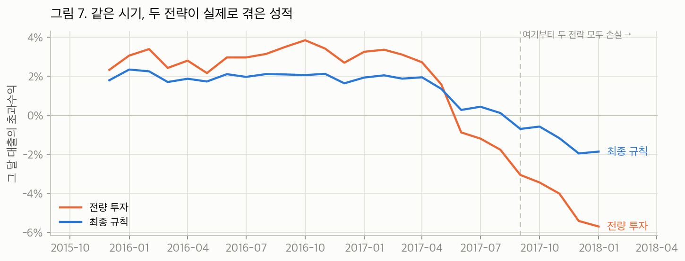

# A Study of the Risk-Adjusted Performance of Lending Club Loan-Screening Rules
## — Centered on Time-Based Evaluation and Statistical Testing —

Team members: Seojin Kwon, Juhee Lee, Seoyoung Jeon, Uijin Jeong, Wooseok Han, Taeho Han

---

## Abstract

This study asks which loan applications on Lending Club should be approved so that risk-adjusted excess return improves.

All rules were decided and frozen inside the development data. They were applied exactly once to evaluation data never used in training (36-month term, issued 2015-12–2018-01, 246,009 loans, 26 vintages).

The final rule approves only credit grades A–B, and among those passes only loans whose predicted excess return is positive. Compared with investing in everything, the Sharpe ratio rose from 0.34 to 0.84, and mean excess return also rose, from 1.05% to 1.13%. Risk fell while return increased.

The source of this performance was identified with a random control matched on approval rate. The random control's Sharpe is 0.33, and the +0.51 difference from the final rule is significant under the stationary bootstrap (p<0.001). This difference is the only claim this study validates.

Three things are not validated. First, a timing rule that tries to lead the credit cycle from applicant-pool composition contributed only +0.007 (p=0.737) and was excluded from the final rule. Second, the machine-learning model does virtually nothing inside the final rule, because the gate passes 99.94% of the capital through as-is. Third, the absolute level of the Sharpe ratio fails multiple-testing correction over 103 trials (Deflated Sharpe 0.549).

The first two carry caveats. For timing, the effective sample size of the difference is 2.11, so the absence of an effect was not proven — it was merely undetectable. Used as a ranking instead of a gate, the model beats the random control by 2.65 standard deviations; but since this is a post-hoc diagnostic that reuses the evaluation data, it is not included among the validated claims.

The contribution of this study lies in quantifying why that simple rule works and why nothing beyond it does, using a design equipped with time-based splits, control groups, and multiple-testing correction.

---

## Table of Contents

- **1. Introduction**
  - 1.1. About Lending Club
  - 1.2. Research Objective
  - 1.3. Expected Contributions
- **2. Main Body**
  - 2.1. Methods
    - 2.1.1. Overview of the Study
    - 2.1.2. Three Core Concepts: Excess Return, Vintage, Sharpe Ratio
    - 2.1.3. When Is Information Knowable: Ex-Ante and Ex-Post Variables
  - 2.2. Procedure
    - 2.2.1. Data and Sample Splits
    - 2.2.2. Descriptive Statistics: What Grade-Level and Year-Level Views Show
    - 2.2.3. Temporal Leakage: How Random Splits Inflate Performance
    - 2.2.4. Designing the Screening Rule: Grade Cut and Risk-Free Gate
    - 2.2.5. Designing the Approval-Rate Timing Rule
  - 2.3. Results
    - 2.3.1. Control-Group Design: What to Compare Against
    - 2.3.2. Testing the Timing Rule
    - 2.3.3. Final Evaluation: Performance of the Six Strategies
    - 2.3.4. Statistical Tests of the Differences
    - 2.3.5. Reliability Checks on the Inference
- **3. Conclusion**
  - 3.1. Discussion and Implications
  - 3.2. Limitations and Future Work
- **4. References**

Appendix. Reproduction Guide

---

# 1. Introduction

## 1.1. About Lending Club

Lending Club (hereafter LC) is a US peer-to-peer (P2P) lending platform founded in 2006, and it works as follows. A borrower submits an application on the LC website; LC underwrites it — credit score, income, debt-to-income ratio, and so on — and assigns a credit grade from A (best) to G (worst). The lower the grade, the higher the nominal interest rate. Approved loans are listed to investors, who allocate funds to the loans they choose and receive monthly principal-and-interest payments. LC made its first loan in 2007, grew rapidly, and listed on the New York Stock Exchange in 2014.

From the investor's point of view, an LC loan is a risky asset. If the borrower keeps their promise, the investor earns the nominal rate; on default, part of the principal is lost. The problem the investor faces is therefore: **"Among the many loan applications, which ones should capital be allocated to?"** This study addresses that capital-allocation problem.

## 1.2. Research Objective

The objective of this study is to construct a screening rule that answers **which loans should be approved so that risk-adjusted excess return improves**, and to validate its performance through statistical methods.

### Why "risk-adjusted excess return" rather than "default prediction"

We did not set "predicting defaults accurately" as the objective, because default-prediction accuracy and investment performance are not the same thing.

Consider two cases.

- Even a loan predicted to default is worth approving if its nominal rate is high enough to more than compensate the loss.
- Even a loan that will not default is better rejected if its return falls short of Treasuries.

That is, "calling defaults well" and "making money well" are different things, and there must be no gap between the objective a model is designed for and the metric by which it is evaluated. The evaluation metric should be defined directly in terms of what the investor actually receives — excess return over the risk-free asset and its volatility. Following this principle, every rule in this study is chosen and evaluated on excess-return-based metrics (the Sharpe ratio).

### Principles for validation

We also follow these principles when validating performance.

The quality of loan data varies substantially over time. If train/evaluation data are split at random, the model can indirectly memorize future information — **temporal leakage** — and measured performance ends up inflated.

This study performs every split in time order, and separately measures and reports, in a dedicated experiment, exactly how much leakage inflates performance (Section 2.2.3).

## 1.3. Expected Contributions

This study delivers two things.

**First, an actionable screening rule.** Statistical significance was confirmed on out-of-sample evaluation data; the final rule reduced risk while simultaneously improving profitability, and its validity was established through control-group design and bootstrap testing.

**Second, quantified evidence about what does not work.** Specifically:

- The timing rule that tries to lead the credit cycle from applicant-pool composition could not be adopted, because its contribution was indistinguishable from zero.
- The added value of the machine-learning model was not identified within the way the final rule uses it (a sign gate).
- The absolute level of the Sharpe ratio failed multiple-testing correction.

Reporting these negative results with the same rigor as the positive ones is part of the point: they are an empirical illustration of the paths by which the over-optimistic performance claims repeatedly reported in the literature come about.

---

# 2. Main Body

## 2.1. Methods

### 2.1.1. Overview of the Study

**Stage 1 — Development.** Everything is completed inside the development file (`lending_club_2020_train.csv`).

1. Split the data in time order into train / valid / quiz blocks (a test block carved out of the training dataset).
2. Fit the excess-return prediction model (XGBoost) on the train block, and set the early-stopping point with the valid block.
3. Decide and freeze the grade cut, the risk-free gate, and the timing rule on the quiz block.

**Stage 2 — Final evaluation.** After all rules are fixed, open the evaluation file (`lending_club_2020_test.csv`) **once**. Apply the frozen rules without modification, measure performance, and — to identify the source of performance — evaluate six strategies together, including a random control matched on approval rate.

The reason for the two-stage split is this: if rules are decided while looking at the data used for evaluation, the resulting score reflects the optimism bias of the selection process, not the skill of the rule.

The separation of development and evaluation is enforced by code structure. `develop()` in [src/pipeline.py](../src/pipeline.py) loads only the development file, decides and freezes the full set of rules, and returns them. The final evaluation stage applies the frozen rules without modification.

### 2.1.2. Three Core Concepts: Excess Return, Vintage, Sharpe Ratio

Three concepts are used throughout this study.

#### (1) Excess return — how much more than Treasuries

Let $R_i$ be the total payments received on loan $i$, $P_i$ its principal, $\tau_i$ its holding period, and $r_f$ the Treasury yield at the same point in time. The excess return is defined as

$$
\mathrm{ER}_i = \frac{R_i - P_i}{P_i} - r_f \tau_i .
$$

The structure is the loan's return minus the Treasury yield.

Because the investor always has Treasuries as an alternative, the Treasury yield is subtracted from the return. Treasuries carry essentially no risk of principal loss, so the margin over Treasuries is precisely the baseline that tells us whether the compensation for bearing credit risk was real.

This definition connects to the assumption that "rejected capital is parked in Treasuries," making strategies with different approval rates comparable on fair terms. The Treasury yield used is the 3-year rate (FRED DGS3), matched to the loan term and pinned at issuance; the 5-year rate (FRED DGS5) was excluded because too few usable observations exist.

#### (2) Vintage — why loans are grouped by month

The unit of observation in this study is not the individual loan but the **vintage: the bundle of loans issued in the same month**.

We do not measure risk at the individual-loan level because, in a large portfolio, the idiosyncratic risk of individual borrowers is diversified away. Buy thousands of loans and the "some default, some repay" variation converges to its mean. The risk investors actually face is **how much the performance of the whole portfolio varies with when it was issued**.

With approval rate $a_v$ for vintage $v$, internal rate of return (IRR) $y_v$ of the approved loans, and risk-free rate $r_{f,v}$ ([src/metrics.py](../src/metrics.py)):

$$
\mathrm{ER}_v = a_v (y_v - r_{f,v}), \qquad
\text{TotalReturn}_v = r_{f,v} + \mathrm{ER}_v .
$$

#### (3) Sharpe ratio — return per unit of risk

The mean of the vintage excess-return series divided by its standard deviation. The Sortino ratio uses only the downside deviation $s^-$ in the denominator.

$$
\mathrm{Sharpe} = \frac{\overline{\mathrm{ER}_v}}{s(\mathrm{ER}_v)}, \qquad
\mathrm{Sortino} = \frac{\overline{\mathrm{ER}_v}}{s^-(\mathrm{ER}_v)} .
$$

#### An identity that follows — the backbone of this study's logic

One property follows from these definitions and runs through the entire study. It is used repeatedly later, so we fix it here.

> **If the approval rate is lowered to a constant $a$ without changing the composition of what is approved, the Sharpe ratio does not change.**

With composition unchanged, the $y_v$ series is unchanged. Then in $\mathrm{ER}_v = a_v(y_v - r_{f,v})$, the numerator (mean) and the denominator (standard deviation) are both scaled by the same $a$, so $a$ cancels out.

The implications of this property matter.

- Explanations of the form "we approved fewer loans, so we became safer" are **hard to sustain**.
- The channels that move Sharpe are (i) changing the **composition** of what is approved, or (ii) varying the approval rate **over time**.
- Put differently, even at a constant approval rate, changing the composition moves Sharpe — and grade screening is exactly that case.

The screening rule of Section 2.2.4 is channel (i); the timing rule of Section 2.2.5 is channel (ii). The control design of Section 2.3.1 verifies this property empirically.

### 2.1.3. When Is Information Knowable: Ex-Ante and Ex-Post Variables

LC data mixes variables spanning a loan's entire life, so variables must be sorted by **when they become observable**.

- **Ex-ante variables**: information available at the moment of the approval decision. Application amount, annual income, debt-to-income ratio (dti), FICO score, credit-inquiry history, LC's assigned grade, and so on.
- **Ex-post variables**: information observable only after the loan is originated. Total payments (total_pymnt), repayment status (loan_status), last payment date, and so on.

Only ex-ante variables may enter the approval rule. If ex-post variables are included, the model ends up predicting the outcome by looking at the outcome; measured performance rises dramatically, but the practical value is unconvincing.

This study goes one step further: **the discipline of observation timing must apply not only at the variable level but also at the sample level.** Even with only ex-ante variables, a random train/evaluation split assigns loans from the same issuance month to both sides, letting the model memorize "the default level of that period" — a leak. That is the temporal leakage quantified in Section 2.2.3, and the same discipline was applied to variable selection (excluding variables whose missingness pattern acts as a clock) and to the early-stopping decision.

## 2.2. Procedure

### 2.2.1. Data and Sample Splits

The data come as two files.

- `lending_club_2020_train.csv` — development only. Model training and all rule decisions are completed inside this file.
- `lending_club_2020_test.csv` — opened exactly once after the rules are frozen, to produce final performance only.

The development file was further split, in time order, into three blocks at **6:2:2 by number of issuance months (vintages)** ([src/split.py](../src/split.py)).

| Block | Role |
|---|---|
| **train** | model-training window |
| **valid** | early-stopping decision window |
| **quiz** | window where the grade cut, gate, and timing rule are **decided** |

XGBoost's iterative fitting overfits the training data, so training must stop at the point where improvement stalls on a later window it never trained on; the valid block plays that role.

No performance is reported on the quiz block; it is used only for rule selection.

Because LC's volume is concentrated in the later years, a 6:2:2 split by loan count would leave the last block only 15 months long. That is too short to estimate the Sharpe denominator (between-vintage variation), so the split criterion was set to vintage count rather than loan count.


The train block spans about six years but only 90 thousand loans, while the quiz block spans just over two years with 370 thousand. This is due to LC's small scale in its early years.

The final evaluation target is 36-month loans issued 2015-12–2018-01: 246,009 loans, 26 vintages. 60-month loans were excluded from the conclusions; the reason is stated in Section 3.2.

### 2.2.2. Descriptive Statistics: What Grade-Level and Year-Level Views Show

Before designing rules, we examine descriptive statistics of the development file.

All numbers below are computed on the development file, from the 723,706 36-month loans with settled outcomes (Fully Paid, or Charged Off/Default) issued before 2018-01 — that is, guaranteed to be fully matured as of the 2021-01 snapshot. Recovery here is the nominal cumulative ratio of total payments to principal, an overview metric that ignores the time value of money. Precise returns are the excess returns defined in Section 2.1.2.

#### Distribution and performance by grade

| Grade | Share of loans | Avg. nominal rate | Default rate | Recovery at maturity | Recovery on defaulted loans |
|---|---|---|---|---|---|
| A | 22.4% | 7.1% | 5.8% | 106.4% | 61.3% |
| B | 34.3% | 10.6% | 12.2% | **107.4%** | 62.5% |
| C | 27.2% | 13.9% | 19.4% | 106.5% | 61.5% |
| D | 11.9% | 17.7% | 25.8% | 105.5% | 60.6% |
| E | 3.3% | 21.4% | 31.7% | 103.2% | 59.1% |
| F | 0.7% | 25.1% | 35.7% | 101.8% | 57.4% |
| G | 0.2% | 27.7% | 46.3% | 94.8% | 57.1% |

Volume is concentrated in A–C, which hold 84% of the total. The statistical features visible in this table supply the main implications and premises of the analysis that follows.

**First, default rates rise more steeply than interest rates.** The nominal rate roughly quadruples from A to G (7.1% → 27.7%), but the default rate rises roughly eightfold (5.8% → 46.3%). As a result, recovery at maturity peaks at B (107.4%) and declines monotonically; G fails even to return principal (94.8%).

**Second, recovery after default is unrelated to grade.** Every grade sits at 57–62%. The information a grade carries is the probability of default, not the severity of loss.

**Third, the top grade A's recovery (106.4%) is actually lower than B's.** It is safe, but its low rate compresses the return.

The first fact becomes the micro-foundation of the grade cut in Section 2.2.4. The third foreshadows why the stopping point is A–B rather than "A only."

#### Volume and default rate by issuance year

| Issuance year | Loans | Default rate | Recovery at maturity |
|---|---|---|---|
| 2007 | 378 | 25.4% | 96.4% |
| 2008 | 1,434 | 20.4% | 102.6% |
| 2009 | 3,170 | 13.9% | 107.9% |
| 2010 | 5,475 | 11.1% | 109.4% |
| 2011 | 8,409 | 10.6% | 109.4% |
| 2012 | 26,118 | 13.7% | 110.1% |
| 2013 | 60,302 | 12.2% | 111.1% |
| 2014 | 97,233 | 13.8% | 109.0% |
| 2015 | 170,294 | 14.9% | 106.7% |
| 2016 | 194,389 | 15.9% | 106.0% |
| 2017 | 148,058 | 17.3% | 103.1% |

(Loans issued in 2018 or later are excluded from the table by the full-maturity condition.)

Two observations stand out.

**First, volume piles up sharply in the later years.** All of 2007–2013 combined is about 105 thousand loans — less than the 194 thousand of 2016 alone. This is why Section 2.2.1 set the split criterion to vintage count rather than loan count.

**Second, performance varies systematically with issuance timing.** The default rate trends upward from its 2011 trough of 10.6% to 17.3% in 2017. Recovery falls from 111.1% (2013) to 103.1% (2017). Even an identical grade mix performs differently depending on when it was issued.

The second fact is the empirical basis for defining the unit of observation as the vintage (Section 2.1.2) and measuring risk as between-vintage variation.

One further point deserves attention: the early-year samples are only hundreds to thousands of loans. However long the series looks, its real information content is far smaller — a point revisited in Section 2.3.5.

Long-run trends in applicant-pool composition (mean credit score, debt-to-income ratio, interest rate) are presented in Figure 5 (Section 2.2.5).

### 2.2.3. Temporal Leakage: How Random Splits Inflate Performance

We directly measured how much performance is inflated when a random split replaces the time-based split.

#### Starting point: when you lent decides 11 percentage points

LC loan quality moved substantially over time. Grouping the settled 36-month loans in the development file by issuance year and computing excess returns gives:

| Issuance year | 2013 | 2014 | 2015 | 2016 | 2017 |
|---|---|---|---|---|---|
| Excess return | **+9.5%** | +6.3% | +3.6% | +3.0% | **−1.7%** |

Loans issued in 2013 earned +9.5 p.p. over Treasuries, while 2017 issuance turned negative at −1.7%. **The return gap by vintage year reaches as much as 11.2 p.p.**

Changes in the grade mix across years explain part of this, but the same directional variation over time appears even in a series with the grade fixed at A–B (Figure 7, Section 2.3.3).

#### How this era effect becomes leakage — three steps

**First, loans issued in the same month share common macroeconomic shocks.** March-2013 loans are different borrowers, yet they all repaid well together, while 2017 loans did not. Common shocks act at the vintage level, independent of individual creditworthiness.

**Second, under a random split, information about these common shocks leaks between the training and evaluation sets.** Half of the March-2013 loans go into training, the other half into evaluation. The model looks at the training half and learns "this profile repays well." But much of why they repaid is not that the borrowers were sound — it is **that it was 2013**. And since the evaluation half is also from 2013, the memorization scores perfectly. What the model actually did was not discriminate among borrowers; it memorized "2013 was a good year."

**Third, evaluation results based on a random split do not reflect the real decision environment.** When deciding approvals in March 2017, whether March 2017 is a good month becomes known only in March 2020, at maturity. The information the random split hands the model is **information that could not, in principle, be possessed at decision time.** A score earned by leaning on it is not an estimate of live performance.

The remedy is a time-based split (out-of-time validation): strictly separating the training and evaluation windows in time blocks cross-period information leaks and reproduces the same conditions as real decision-making.

#### Dropping the issuance-date variable is not enough

Meanwhile, merely removing the date feature from the model's inputs cannot fundamentally block this leak.

The levels of many variables shift over time — the debt-to-income ratio climbs monotonically from 13.4 to 19.3 over ten years (Section 2.2.5), among others. The joint distribution of the 37 features therefore reveals, to a substantial degree, when a loan was issued. The block must come from the split design, not from deleting variables.

#### Measurement


Holding the model, features, and rule fixed and changing only the split:

| | Time split (this study) | Random split |
|---|---|---|
| Prediction correlation — quiz block | **0.024** | 0.387 (~16×) |
| Final Sharpe — evaluation data | **0.84** | 1.32 |

Note that the two rows are measured in different places: the prediction correlation on the development-stage quiz block, the Sharpe on the final evaluation data.

Much of the high performance reported in the literature can be explained through this channel. This study reports 0.024 as the honest estimate; 1.32 remains only as an unreachable ceiling in the table of Section 2.3.1.

#### Pinning down exactly what the leak is

**The leak is not the ability to identify the period — it is the fact of having already seen that period's outcomes.**

Identifying the period is perfectly possible in live decision-making too; nobody in March 2017 is unaware that it is March 2017. The problem is that the random split also puts that period's **outcomes** into the training data.

This distinction is reused in Section 2.3.2, where essentially the same variables can identify the period yet fail to predict performance — precisely because the answer key is absent.

#### The same principle applied to variable selection

The roughly 50 credit-inquiry-related fields LC began collecting around 2015–2016 are entirely missing for earlier issuance. Tree models can use missingness itself as a clock.

We therefore excluded every variable whose missingness rate moves more than 30 p.p. across periods (`SAFE_FEATURE_COLS` in [src/config.py](../src/config.py)). Early stopping was likewise performed on the later valid block, so that no future information enters even the decision of when to stop training ([src/model.py](../src/model.py)).

### 2.2.4. Designing the Screening Rule: Grade Cut and Risk-Free Gate

The screening rule combines two elements.

**Grade cut.** Seven candidates — A only, A–B, …, A–G (everything) — were measured on the quiz block.

**Risk-free gate.** Approve only loans whose model-predicted excess return is positive. This is the self-evident criterion of excluding loans predicted to underperform Treasuries. What matters here is that it has **no tunable parameter**: the pass rate is an outcome, not a target, so the path of scanning thresholds and happening upon a favorable setting is blocked at the source.

#### How to choose the grade cut — why "maximize Sharpe" is inappropriate

"Maximize Sharpe" cannot serve as the selection criterion for the grade cut.

Tightening the grades raises Sharpe monotonically. But approving A only drops capital deployment to 24% and shrinks mean excess return to 0.45%. Sharpe attaches no penalty to scale, so it cannot stop such extremes.

We therefore introduce mean–variance utility:

$$
U(\mu,\sigma;\lambda) = \mu - \frac{\lambda}{2} \sigma^2
$$

Here $\lambda$ is risk aversion — the larger it is, the more the investor dislikes risk.

But we cannot know the investor's $\lambda$. So we invert the direction and back out the $\lambda$ at which two adjacent candidates (the looser one $L$, the tighter one $T$) become indifferent in utility (`indifference_lambda` in [src/pipeline.py](../src/pipeline.py)):

$$
\lambda^{\ast} = \frac{2 (\mu_L - \mu_T)}{\sigma_L^2 - \sigma_T^2}
$$

$\lambda^{\ast}$ is **the price of tightening one more notch.** Even without estimating any investor's $\lambda$, the point where $\lambda^{\ast}$ spikes is the rational stopping point.

#### Measurement



The numbers in Figure 3 are development-stage values (quiz block). The final evaluation of Section 2.3 covers the same calendar window but entirely different loans, so the numbers differ slightly — for example, A–G's Sharpe is 0.38 on the quiz block and 0.34 in the final evaluation.

From A–G to A–C, risk (standard deviation) falls from 3.0% to 2.3% while mean return **actually rises**, from 1.12% to 1.33%. That is, risk falls before return does. From the next step onward, return starts falling too.



The $\lambda^{\ast}$ sequence, from A–G→A–F onward, is −44, −59, −24, −6, 14, 79.

Negative values mean tightening actually increases return — dominance regardless of risk preference; the exclusion of grades F and G is this case.

Then comes the crux. A–C→A–B gives 14, and **A–B→A jumps to 79, about six times the previous step.** The stopping point is therefore A–B.

#### Worth noting: the risk-free gate does almost nothing on its own

Full investment's Sharpe of 0.3746 merely becomes 0.3754 with the gate applied, because the model judges 99.94% of the capital "superior to Treasuries."

The gate is logically justified and has the merit of no tunable parameter. But **the substance of the performance is the grade cut.**

This is, however, a statement about the gate as a **mode of use**, not about the information the model contains. Used as a ranking, the same model behaves differently — confirmed in Section 2.3.2.

#### The choice of algorithm does not change the conclusion

This study used only XGBoost, so we need to check whether the model choice drove the results.

Under the identical time split (train for fitting, valid for early stopping, quiz for measurement), four algorithms were compared ([src/experiment_model_compare.py](../src/experiment_model_compare.py)). The evaluation file was not opened.

| Model | Prediction corr. | Gate pass rate | Grade A–B × gate Sharpe | Rank-cut Sharpe |
|---|---|---|---|---|
| **XGBoost (main)** | 0.0235 | 99.93% | 0.8098 | **0.8756** |
| LightGBM | 0.0186 | 99.94% | 0.8082 | 0.8593 |
| CatBoost | 0.0048 | 100.00% | 0.8081 | 0.8254 |
| Ridge linear | 0.0074 | 99.93% | **0.8105** | 0.8222 |

**In the final rule's form (grade cut × gate), Sharpe is the same 0.808–0.811 no matter which algorithm is used.** The spread is only 0.0024, and Ridge linear regression — not a tree model — takes the narrow top spot. Gate pass rates exceed 99.9% for every model.

So the statement above — "the gate does nothing and the substance of the performance is the grade cut" — is not a property of a particular algorithm. It is a **property of this rule form**, and the conclusion survives changing the model.

By contrast, using the models as rankings exposes algorithmic differences. Rank-cut Sharpe spans 0.822–0.876, a spread of 0.053, and prediction correlations differ fivefold, 0.005–0.024. The orderings of the two metrics also broadly agree (the top two models are XGBoost and LightGBM in both).

This points in the same direction as the Section 2.3.2 result that "the model's ranking carries information." At the same time, it means that **if ranking-based use were formally adopted, algorithm choice would genuinely become an issue.**

This comparison was performed after the rules were frozen, so its four trials are added to the multiple-testing total (Section 2.3.5).

#### Why the grade cut works without hurting returns

The grade-level statistics of Section 2.2.2 provide the micro-foundation.

Moving down the grades, nominal rates rise about 4× (7.1% → 27.7%). But default rates rise about 8× (5.8% → 46.3%) — more steeply. And recovery on default is fixed at 57–62% regardless of grade.

In short, the high rates of the low grades fail to compensate for their elevated default probability. The evidence is recovery at maturity peaking at B and declining monotonically. Tightening to A–B is therefore not discarding a source of return.

Add to this Figure 3's finding that excluding the low grades reduces between-vintage volatility before it reduces return: the numerator (mean return) is preserved while only the denominator (volatility) shrinks, and Sharpe rises.

### 2.2.5. Designing the Approval-Rate Timing Rule

#### Why cross-sectional screening alone is not enough

The grade cut through Section 2.2.4 is cross-sectional screening — it addresses "which loans to pick." This approach has a limitation in principle.

As the year-level table in Section 2.2.2 showed, default rates deteriorated trend-wise with issuance timing, from 10.6% in 2011 to 17.3% in 2017. And this deterioration is not confined to particular grades.

**When a common credit cycle drags all grades down together, cross-sectional screening reduces the depth of the losing vintages but not their number.** Reducing the number requires a timing judgment — "when, and how much, to deploy" — not "which loans to pick."

#### Terminology: "timing" and the "dial"

**In this report, "timing" means adjusting the monthly deployment fraction.**

Which loans qualify (the grade cut and gate of Section 2.2.4) stays fixed. What changes from month to month is **what percentage of that month's qualifying loans is actually funded.**

We call this fraction the **dial**. A dial of 1.00 funds all qualifiers; 0.80 funds only 80% of them.

#### Rule design — four steps

The problem is that a 36-month loan's performance is settled only three years later. At the moment the approval decision is made, no realized data exists to say whether the month is good or bad.

We therefore adopted, as a proxy, **information observable without delay at decision time**: the composition of the applicant pool — that month's applicants' average debt-to-income ratio, interest rate, and credit score ([src/timing.py](../src/timing.py)). The procedure has four steps.

**1. Estimate the relationship.** Using **only vintages already fully matured as of the current month**, estimate the relationship "applicant-pool composition → realized performance" by ridge regression. For a March-2017 decision, only issuance before March 2014 is used.

**2. Predict performance.** Apply that relationship to the current month's applicant-pool composition to predict the current vintage's performance.

**3. Compute the dial.** Divide the prediction by **the mean of the predictions observed so far** — that mean stands for "normal." Because it includes the hundred-odd training-period vintages, the comparison base is well-populated even at the start of the evaluation window. The result is clipped to 0.35–1.00.

$$\text{dial}_v = \mathrm{clip}\left(\frac{\text{current prediction}_v}{\text{mean of past predictions}},\ 0.35,\ 1.00\right)$$

Equal to normal gives 1.00 — fund fully. Predicted at 70% of normal gives 0.70 — fund 30% less. The dials actually observed in the evaluation window ranged **0.685–1.000**.

**4. Deployment.** What remains is how to shed the excluded share. It is not funding everything proportionally less. **Rank that month's qualifying loans by model-predicted excess return and fund only the top share** (`weights` in [src/timing.py](../src/timing.py)). A dial of 0.70 buys the top 70% and discards the bottom 30%.

No post-decision information is used at any step.

Step 4 becomes important later, so we stress it: **turning the dial down means not "buy less" but "throw away the worst-looking first."** Moving the dial therefore changes not only the deployment scale but also the **composition** of what is approved.

#### The shape of the signals the rule reads

The long-run trends of the applicant-pool composition the rule uses as input are as follows.



Figure 5 arrays the five series together with linear trend lines (dotted), in descending order of R². Moving left to right, the straight line explains the series less and less.

| Series | Min–max | Endpoint change | Linear trend | R² | Actual shape |
|---|---|---|---|---|---|
| Debt-to-income (dti) | 10.8–20.1 | +6.1 | +8.3 | **0.87** | monotone rise |
| Inquiries (inq_last_6mths) | 0.5–2.8 | −2.4 | −1.2 | **0.67** | monotone fall |
| Credit score (FICO) | 694.8–727.4 | +17.1 | −20.4 | 0.36 | peaked |
| Revolving utilization (revol_util) | 42.7–63.4 | −5.8 | +2.8 | 0.03 | trendless oscillation |
| Applied rate (int_rate) | 9.4–13.8% | −1.0 p.p. | −0.4 p.p. | 0.01 | trendless oscillation |

(Endpoint change and linear trend are both expressed per decade.)

**Of the five series, only two deserve to be called trends — the debt-to-income ratio (rising, R²=0.87) and the inquiry count (falling, R²=0.67) — and both are monotone in shape.**

Note how the two numbers in the credit-score row disagree even in sign: connecting the endpoints gives +17.1, while the regression line gives −20.4. That is because this series is not monotone but peaked.

Specifically, it sits high at 718–721 in 2009–2011, sags to the 698s in 2013–2016, and rebounds to 711 at the end. The first half (2008–2012) averages 714.8 and the second half (2013–2017) 699.8, so the regression line tilts downward. Yet the 2007 starting point is the minimum of the entire series, so connecting the endpoints tilts upward.

Neither is correct. The very attempt to summarize such a series in a single direction fails. The credit score has no trend; it has a peak.

The interest rate is simpler still: it merely oscillates between 9.4% and 13.8%, and with R² of 0.01, 99% of its variation is unexplained by trend. That the endpoint is below the start is chance, not direction.

So the signals this rule actually holds are **two: the monotonically rising debt-to-income ratio and the monotonically falling inquiry count.** Opposite in direction but both monotone in shape — and that shared shape predetermines the rule's fate. The implication is taken up in Section 2.3.2.

#### Fixing the adoption criterion in advance

This rule's performance is tested in Section 2.3.2, once the controls are in place. As with the screening rule, its specification was frozen at the development stage, and the evaluation data remained unopened up to that point.

Along with the specification, **the adoption criterion is also fixed in advance.** Timing is not a component of the final rule but an optional overlay on top of it. It is adopted only if a significant contribution over the time-invariant control is confirmed. If not, the final rule remains exactly the grade cut × gate frozen in Section 2.2.4.

There is a reason for writing the criterion down before the result: to block, for timing as well, the very path of optimism bias this report set out to block from the start — choosing a rule's components after seeing evaluation scores.

## 2.3. Results

### 2.3.1. Control-Group Design: What to Compare Against

After freezing the full set of rules, `lending_club_2020_test.csv` was opened once and the rules applied. Before presenting results, we fix what to compare against.

#### Why controls are needed

Applying the final rule raised Sharpe from 0.34 to 0.84. But that number alone cannot tell us **what created the performance**, because at least three plausible stories exist:

1. **By approving less** — you approved only half, so didn't you simply get safer?
2. **By picking well** — same volume, but only good loans were chosen?
3. **By timing it right** — less was deployed in bad periods?

All three can raise Sharpe. Unless the three are separated, the claim "screening works" does not stand. Controls are the device for isolating them one by one.

#### There are only four knobs

Six strategies appear in this study, but only four axes generate them.

| Knob | What it sets | Possible values |
|---|---|---|
| **A. What to pick** | composition of approvals | everything / random / grades A–B |
| **B. How much to deploy** | average level of the approval rate | 100% / 57% / 55% / 53% |
| **C. Vary by month?** | time variation of the approval rate | constant / varying |
| **D. How it was trained** | train/evaluation split design | time split / random split |

The six strategies are different combinations of these four knobs ([src/rules.py](../src/rules.py), [src/pipeline.py](../src/pipeline.py)).

| Strategy | A: pick | B: deploy | C: time-varying | D: split |
|---|---|---|---|---|
| Full investment | everything | 100% | constant | — |
| Random selection | **random** | 57% | constant | — |
| **Final rule** | **grades A–B × gate** | 57% | constant | time |
| Time-invariant twin | grades A–B × gate | **55%** | constant | time |
| Timing | grades A–B × gate | 53% | **varying** | time |
| Leakage ceiling | grades A–B × model rank | 53% | constant | **random** |

This table has exactly one use. **Two rows differing in exactly one cell form a control pair, and that one cell is what the comparison measures.**

In words, the strategies are:

- **Full investment** — approve every application. The baseline corresponding to Lending Club's actual policy.
- **Random selection** — the same approval rate as the final rule, but loans chosen at random (average of 20 seeds). It captures only the effect of shrinking the approval scale itself. **This is the study's benchmark for judging performance.**
- **Final rule** — the grade A–B × risk-free gate frozen in Section 2.2.4.
- **Time-invariant twin** — same average approval rate as timing, but the approval rate never varies over time.
- **Timing** — the final rule with the approval-rate timing of Section 2.2.5 layered on top.
- **Leakage ceiling** — the ceiling reached when the temporal leakage of Section 2.2.3 is allowed. A reference line that cannot actually be attained.

#### The ladder: one knob at a time

The six strategies should be read not as a list but as a ladder. Start from full investment and turn **exactly one** knob per rung.

| Step | Knob turned | Strategy reached | Sharpe | What this step means |
|---|---|---|---|---|
| Start | — | Full investment | 0.34 | LC's actual policy |
| 1 | **B** 100% → 57% (same composition, random thinning) | Random selection | 0.33 | effect of scale alone |
| 2 | **A** random → grades A–B | **Final rule** | **0.84** | **effect of screening** |
| 3 | **B** 57% → 55% (trim from the bottom) | Time-invariant twin | 0.89 | effect of trimming |
| 4 | **C** constant → varying | Timing | 0.90 | effect of timing |
| Aside | **D** time split → random split | Leakage ceiling | 1.32 | the ceiling when cheating |

The fact that Sharpe does not move at step 1 determines the interpretation of step 2. Shrinking scale with composition fixed does nothing (the identity of Section 2.1.2), so the 0.33 → 0.84 at step 2 is made by **composition**, not scale.

Between steps 3 and 4 there is a residual: deployment moves a further 1.2 p.p., from 55% to 53%. It is the part where knob C is not perfectly isolated; its direction and size are treated in the "reconciliation residual" note of Section 2.3.2.

#### The misreading each control blocks

Each control blocks one specific wrong conclusion.

| Control | Without it |
|---|---|
| **Random selection** | No answer to the objection "didn't you get safe by halving approvals?" In fact this control's Sharpe is 0.33, essentially equal to full investment's, showing that scale reduction alone creates no performance. |
| **Time-invariant twin** | Timing's contribution would be reported roughly eightfold inflated, at +0.055; most of that belongs to bottom-trimming, not time variation (Section 2.3.2). |
| **Leakage ceiling** | No baseline for explaining why the high Sharpes reported in the literature are high. This value is not a target but a line one must not reach. |

The claim this study seeks to establish thus narrows to **rung 2 of the ladder alone.** The remaining comparisons either support that claim (rung 1) or adjudicate devices that were not adopted (rungs 3–4).

### 2.3.2. Testing the Timing Rule

We now adjudicate the approval-rate timing rule designed in Section 2.2.5. The comparator is not the final rule but the **time-invariant twin**.

#### Why comparing against the final rule is wrong

Timing deploys 53.3% of the capital; the final rule deploys 56.9%. Timing thus (i) deploys less than the final rule and (ii) varies that deployment monthly. Comparing the two directly cannot separate how much of the performance gap is (i) and where (ii) begins.

A deployment gap of only 3.6 p.p. does not license ignoring (i) — and this is not something to guess at; it can be measured.

The **time-invariant twin** keeps (i) identical to timing and removes only (ii). Where timing's dial wanders between 0.685 and 1.000 month by month, the twin places one constant identically in every month.

That constant is **0.937**. It was not chosen by the researchers but computed to match the deployment scale of the two strategies (0.5332 ÷ 0.5691, [src/pipeline.py](../src/pipeline.py)).

The tightening procedure is also the same: both rank the month's loans by model score and cut from the bottom. The only difference is that timing varies the amount cut from month to month. The difference between the two strategies is therefore exactly the share attributable to "when you cut."

#### Decomposing the gap

Placing the twin in between splits the gap between the final rule and timing into two shares.

| Segment | Deployment change | Sharpe change | Whose share |
|---|---|---|---|
| Final rule → time-invariant twin | 56.9% → 54.5% (−2.4 p.p.) | 0.843 → 0.891 (**+0.047**) | bottom-trimming |
| Time-invariant twin → timing | 54.5% → 53.3% (−1.2 p.p.) | 0.891 → 0.898 (**+0.007**) | **time variation (timing)** |
| Final rule → timing (total) | −3.6 p.p. | +0.055 | the two mixed |

**Cutting deployment by just 2.4 p.p. moved Sharpe by 0.047** — six times timing's entire share of 0.007.

Of the total gap of 0.055, only **14% attributes to timing; the remaining 86% comes from deploying less.** Had we compared only the final rule and timing and written "timing earned +0.055," we would effectively have credited trimming's performance to timing.

Why does a few percentage points of deployment matter so much? Because the reduction is **not proportional.** Bottom-trimming changes the composition of what is approved, so the identity of Section 2.1.2 (a composition-preserving reduction cannot move Sharpe) does not apply here. Where the identity does hold — random selection matched on approval rate — Sharpe is 0.33, essentially the same as full investment's 0.34.

> **Reconciliation residual.** The twin's 54.5% deployment misses timing's 53.3% by 1.2 p.p. This happens because the dial applies as a quota on count ranks rather than on dollars, and the loans cut are smaller than average (`weights` in [src/timing.py](../src/timing.py)). The residual runs **in timing's favor**: by the slope of the first row above, timing would have gained additional trimming share merely by tightening 1.2 p.p. more than the twin. The +0.007 measured below is therefore a generous, not a stingy, estimate of timing's pure contribution — and it does not weaken the conclusion not to adopt.

#### Test result

| | Value |
|---|---|
| Timing's Sharpe | 0.90 |
| Time-invariant twin's Sharpe | 0.89 |
| **Timing contribution (ΔSharpe)** | **+0.007** |
| 95% confidence interval | −0.053 to 0.043 |
| p-value | **0.737** |
| Corr(prediction, realized performance) | 0.034 |

The confidence interval contains zero, so **this rule's contribution is indistinguishable from zero.**

A methodological caveat applies to the interpretation, however. The effective sample size of the difference is only about 2.11, so this test has the **structural limitation of very low statistical power — only very large effect sizes could be detected.** The correct reading of the result is therefore not "no contribution exists" but "at the current power, no statistically significant difference from zero can be discerned."

What this sample nonetheless does say is a **bound on the effect size.** With a confidence interval of −0.053 to 0.043, a contribution exceeding Sharpe 0.05 would have been observed. So the situation is not "we have no idea whether an effect exists" but "if it exists, it is smaller than 0.05." Of course, the interval itself was built from about two effective observations, so even its width deserves limited trust.

#### What the rule actually did



Apart from the test, what this rule did in this window can be observed directly, without statistical inference. In Figure 6, the months when the rule tightened capital do not line up with the months when performance was actually bad.

- Over 2015-12–2016-06 it cut the approval rate to 69–88%. Yet those vintages did fine, at +2.2 to +3.0%.
- Over 2016-10–2017-09 it deployed 100% in full — exactly the stretch where performance collapsed from +3.8% to −3.1%.
- Tightening began only in 2017-10, already too late.

In short, the rule **tightened capital at the best of times and deployed in full into the deterioration.**

#### The failure has three layers, each more fundamental than the last

**First, the inputs have no bend.**

As seen in Section 2.2.5, of the five indicators only the debt-to-income ratio (monotone rise) and the inquiry count (monotone fall) carry trends; the rest oscillate without direction. But the prediction target — vintage performance — peaks in October 2016 and turns.

Ridge-regression predictions are linear combinations of the inputs. **A linear combination of monotone trends is still a trend; it cannot manufacture a turning point.** The very shape of the signals available to the rule could not encode the bend in the cycle.

**Second, as a result, the prediction became a lagging indicator, not a leading one.**

Aligning predictions and realized outcomes contemporaneously gives a correlation of 0.03. Shifting the predictions earlier raises it dramatically.

| Months shifted earlier | 0 | 3 | **6** | 9 | 12 |
|---|---|---|---|---|---|
| Correlation with realized performance | +0.03 | +0.54 | **+0.78** | +0.07 | −0.22 |

The peaks tell the same story: realized performance peaks in October 2016; the prediction peaks in July 2017.

So this prediction is not meaningless noise — it is **a signal that arrives about six months late.** It does read the cycle, but only after the fact. Approval decisions must be made in the month itself, so a half-year-late signal is worse than none; indeed, it produced tightening in good months and full deployment in bad ones.

**Third, this failure is the flip side of the leakage in Section 2.2.3.**

At first glance the two sections seem to contradict each other. Section 2.2.3 said that the combination of variables alone reveals a loan's period. Yet this section tried to predict period-level performance with **those very variables** and got a correlation of 0.034. In fact, all five variables the timing rule uses are contained, without exception, among the model's 37 (`POOL_FEATURES` in [src/timing.py](../src/timing.py), `SAFE_FEATURE_COLS` in [src/config.py](../src/config.py)).

Is there information or not?

The answer is that the two sections do **different things.** **Identifying** a period is different from **knowing how that period will turn out.**

- The random-split model recognizes a loan's period and then **looks up that period's outcomes**, which sit inside its training data.
- The timing rule recognizes the period but has nothing to look up. March 2017's outcome comes into existence only in March 2020; all the regression holds is outcomes from 2014 and earlier, already matured.

**Both can identify; only one holds the answer key.** That is what separates 0.387 from 0.034.

There is also a difference in information density. The leakage experiment uses 37 variables at the individual-loan level; the timing rule uses some 90 monthly means of five variables. The moment you take a monthly average, borrower-level differences vanish and only period-level levels remain — the same variable names carry different amounts of information.

In short, for this rule to work, the relationship "applicant composition → realized performance" would have to persist across eras. But what Section 2.2.3 quantified is precisely that **this relationship does not persist.** Regressing performance on applicant composition fits not so much the effect of applicant traits as the part of the era effect smeared onto those traits — and when the era changes, that part does not carry over.

Restated in the language of maturity structure: what actually determined the performance of 2017 issuance was the **macro environment of 2020**, when the loans matured — information that did not exist in the applications of 2017. The applicant pool tells you "who is coming to borrow now," not "whether, three years from now, they will face an environment in which they can repay."

#### The scope of this argument

**What this argument shows and what it does not must be kept distinct.**

It is an argument that one particular predictor — the applicant pool — cannot contain a macro shock three years out. It is not a proof that approval-rate timing is impossible in general.

Room remains to attempt the same goal with other information observable at decision time (leading macro indicators, the term structure of interest rates, credit spreads, and so on); this study did not test them.

This section's conclusion therefore extends exactly this far — "this applicant-pool-based specification did not work in this evaluation window, and its contribution was indistinguishable from zero" — and no further.

#### Verdict

By the adoption criterion fixed in advance in Section 2.2.5 — adopt only upon a confirmed significant contribution over the time-invariant control — **timing is not adopted.** The final rule remains exactly the grade A–B × gate frozen at the development stage.

This is the mechanical application of a criterion written down in advance, not a choice of rule made after seeing evaluation results. And it follows not from confirming that timing is useless, but from the principle of **not adopting what is not proven.**

#### Post-hoc diagnostic: what the trimming share of +0.047 really is

The decomposition table called the +0.047 from final rule → twin "bottom-trimming." But that test alone cannot say whether it comes from **the mere fact of removing some loans** or from **the model choosing what to remove.**

This question was not in the pre-registered design, so it was examined with a post-hoc control: keep the grade, the gate, the quota (93.7%), and the trimming procedure all identical to the twin, and **swap only the ranking criterion from model score to random numbers**, measured over 20 seeds ([src/experiment_random_trim.py](../src/experiment_random_trim.py)).

Two things must be stated first.

**First, this measurement reopens the evaluation data.** It is the sole exception to this report's "open once" principle, and it is recorded here so the exception is not hidden. (The algorithm comparison of Section 2.2.4 used development data only, so it is not an exception.)

**Second, this result is therefore a diagnostic, not a validated claim,** and it is added to the multiple-testing trial count (Section 2.3.5).

| | Deployment | Sharpe | vs final rule |
|---|---|---|---|
| Final rule (grades A–B × gate) | 56.91% | 0.8432 | — |
| **Time-invariant twin (top 93.7% by ER̂ rank)** | 54.51% | **0.8905** | **+0.047** |
| Top 93.7% by random rank (mean of 20 seeds) | 53.32% | 0.8479 | +0.005 |

**Removing the same amount at random barely moves Sharpe (+0.005).** This reconfirms the identity of Section 2.1.2: a reduction that leaves composition unchanged cannot move Sharpe.

So most of the +0.047 — **+0.043 — comes not from how much was removed but from what was removed.** The twin's 0.8905 sits **2.65 standard deviations above the mean of the 20-seed random distribution (mean 0.8479, standard deviation 0.0161, range 0.8106–0.8789) and above all 20 seeds.** The random control even deploys 1.2 p.p. less, so the reconciliation residual runs against the twin.

This means **the model's ranking genuinely carries information** — with the caveat that it is measured at only the single quota point of 93.7%, a point revisited in Section 3.1.

### 2.3.3. Final Evaluation: Performance of the Six Strategies



Figure 7 is the raw material for every Sharpe calculation below: the average height of a series is the numerator, its variability the denominator.

After mid-2017 both series enter negative territory. But full investment falls to −5.7% while the final rule stops at −2.0%. The final rule **did not avoid the downturn; it passed through it shallowly.**


The performance of the six strategies is as follows, ordered the same as Figure 8.

| Strategy | Deployment | Mean excess return | Sharpe | Sortino | Losing vintages | Worst month |
|---|---|---|---|---|---|---|
| Full investment (LC's actual policy) | 100% | 1.05% | 0.34 | 0.52 | 8/26 | −5.7% |
| Random selection (benchmark) | 57% | 0.59% | 0.33 | 0.51 | 8/26 | −3.4% |
| **Final rule (grades A–B × gate)** | 57% | **1.13%** | **0.84** | **1.87** | **5/26** | **−2.0%** |
| Timing | 53% | 1.10% | 0.90 | 2.15 | 5/26 | −1.6% |
| Time-invariant twin | 55% | 1.12% | 0.89 | 2.07 | 5/26 | −1.7% |
| Leakage ceiling (unattainable) | 53% | 1.32% | 1.32 | 5.49 | 3/26 | −0.8% |

The reading order follows the ladder of Section 2.3.1.

**Step 1 — shrinking scale alone does nothing.** Cut the approval rate from 100% to 57% but choose at random: Sharpe goes from 0.34 to 0.33, essentially unchanged. Only mean return is damaged, nearly halving from 1.05% to 0.59%. The identity derived in Section 2.1.2 is confirmed empirically.

**Step 2 — at the same scale, changing only how you pick changes performance.** The same 57%, selected by grades A–B instead of at random: Sharpe goes from 0.33 to 0.84. Mean return rises too, from 0.59% to 1.13%. **This difference is the pure contribution of screening, and it is the performance this study validates.**

**Steps 3–4 — timing's contribution is not confirmed.** As shown in Section 2.3.2, the difference between timing (0.90) and the twin with time variation removed (0.89) is 0.007. Timing's worst month, −1.6%, looks shallower than the final rule's, but the difference is not significant.

**Aside — the ceiling when cheating.** Training on a random split reaches 1.32 (Section 2.2.3), but that value leans on temporal leakage. The honest 0.84 is 64% of it.

### 2.3.4. Statistical Tests of the Differences

Each of five comparisons receives a stationary-bootstrap confidence interval and p-value. Both series are resampled **with the same block indices**, preserving the vintage pairing (`sharpe_diff_bootstrap` in [src/inference.py](../src/inference.py)).


| Comparison | ΔSharpe | 95% CI | p-value | Effective n of difference |
|---|---|---|---|---|
| Final rule vs full investment | +0.50 | 0.41 – 1.79 | **<0.001** | 0.36 |
| Timing vs full investment | +0.56 | 0.46 – 1.78 | <0.001 | 0.31 |
| **Final rule vs random selection (screening's pure contribution)** | **+0.51** | 0.42 – 1.85 | **<0.001** | 1.10 |
| Timing vs time-invariant twin (timing's pure contribution) | +0.007 | −0.05 – 0.04 | **0.737** | 2.11 |
| Final rule vs leakage ceiling | −0.48 | −0.73 – −0.41 | 0.039 | 1.40 |

The +0.56 in the second row is how much timing beats full investment. But it must not be read as timing's performance: most of the improvement comes from the grade screening contained inside it, and timing's own share is the fourth row (+0.007), where the average approval rate is controlled.

**That the same strategy can appear as +0.56 or as +0.007 depending on the control is itself the reason control design is necessary.**

#### On the asymmetry of the confidence interval

Note the asymmetry: the point estimate +0.50 sits near the lower end of its confidence interval (0.41–1.79).

The bootstrap distribution's median is 0.50, matching the point estimate. What stretches the interval upward is a long right tail (skewness 5.2; 7% of resamples exceed +1.0). In resamples that happen to draw only low-volatility months, the final rule's denominator collapses toward zero and ΔSharpe explodes upward.

This asymmetry is uncertainty in the direction of "the difference could be even larger." At the same time, the very fact that the denominator flails this easily is itself a small-sample warning.

#### Conclusion

**Screening is significant; timing is not.**

Screening's contribution has bootstrap p<0.001. Mean excess return itself is also 0.54 p.p. above the random control, with p<0.001 in a paired HAC (Newey–West) test. Grade screening thus achieves **risk reduction and return enhancement simultaneously**, and the objection "you sacrificed return to reduce risk" does not stand.

Timing's contribution has a confidence interval containing zero (p=0.737).

The effective-sample-size column must be read alongside. Since the two strategies share the same 26 months, differencing cancels the common cycle — but the effect differs by comparison. Versus the random control it improves from 0.36 to 1.10; versus full investment the two series move almost in parallel, leaving trend in the difference, so it stays at 0.36. **Differencing does not always restore effective sample size.**

### 2.3.5. Reliability Checks on the Inference

We now check how far the preceding results can be trusted statistically — closing off, one by one, the paths by which a lucky score gets mistaken for skill.

#### (1) Autocorrelation and effective sample size

The vintage excess-return series has a first-order autocorrelation of $\rho_1 = 0.956$ — a very high value. Under an AR(1) approximation, the effective sample size is

$$
n_{\mathrm{eff}} \approx n \frac{1-\rho_1}{1+\rho_1}
 = 26 \times \frac{1-0.956}{1+0.956} \approx 0.58
$$

**Twenty-six months of data carry less real information than a single independent observation.** Because the credit cycle moves slowly, even years of data amount to no more than "one observation of the cycle."

This 0.956 mixes a **mechanical component** with the cyclical one. With 36-month loans issued every month, adjacent vintages share 35 of the 36 months over which repayment runs — and a shock in 2020 hits the March-2017 and April-2017 vintages in nearly equal measure. These data cannot separate the two, so $n_{\mathrm{eff}} = 0.58$ should be read as the sum of both components.

#### (2) Confidence intervals and block-length sensitivity

Because of this autocorrelation structure, the final rule's Sharpe confidence interval is very wide: 0.22–4.92. Intervals were produced with the stationary bootstrap (Politis and Romano, 1994) at a mean block length of 12 months.

But resampling 26 observations in blocks averaging 12 months means a single resample consists of barely more than two independent blocks. The nominal 95% cannot be presumed to achieve its stated coverage.

Block length is itself a researcher choice, so we disclose the sensitivity.

| Mean block | 95% CI of ΔSharpe (final rule vs full investment) | p | 95% CI of final rule's Sharpe |
|---|---|---|---|
| 6 months | 0.40 – 2.84 | <0.001 | 0.14 – 8.92 |
| **12 months (main text)** | 0.41 – 1.79 | <0.001 | 0.22 – 4.92 |
| 18 months | 0.42 – 1.67 | <0.001 | 0.25 – 4.75 |

Interval widths swing substantially with block length — the absolute level cannot be pinned down. But **the fact that the lower bound of the difference stays above zero holds at every block length.**

Accounting for the distribution's non-normality, the Probabilistic Sharpe Ratio (PSR; Bailey and López de Prado, 2012) — the probability that the true Sharpe exceeds zero — is **0.717** for the final rule, short of the customary 0.95 bar.

#### (3) Multiple testing: the Deflated Sharpe

Try repeatedly, and the best of the tries rises even without skill. Uncorrected, "the best score out of many attempts" gets mistaken for skill.

This study tried **98 configurations** before freezing the rules. The breakdown: grade cuts 7, terms 2, level recalibrations 3, evaluation-window start points 7, model splits 3, bucket allocation 1, frontier combinations 51, cash-flow timing 4, K sweep 19, timing-rule respecification 1.

Adding the 5 post-freeze diagnostics (algorithm comparison 4, Section 2.2.4; random-trim control 1, Section 2.3.2) gives **103 in total**.

Because even zero skill raises the expected maximum under repeated trials, the Deflated Sharpe (Bailey and López de Prado, 2014) corrects against that expected value as the baseline.

The last item in the list — **timing-rule respecification, 1 trial** — refers to the following.

The rule's first specification contained an error: the reference point for the "normal level" was constructed from the early part of the evaluation window itself rather than from the training period. As a result, the approval-rate dial sat pinned at 100% for 22 of the 26 months. The contribution measured then, +0.048 (p=0.256), was not a test of the timing rule but effectively a test of a rule that does nothing.

After correcting the reference to the full training period, so that the rule actually operated in 15 months, the remeasured result is the +0.007 (p=0.737) of Section 2.3.2. **Correcting the specification did not improve the performance — it made the failure clearer.**

The respecification is counted among the trials for two reasons. One: leaving it out would set the correction baseline below its true level. The other: it answers the objection "maybe the effect failed to show because the implementation was broken."

| Item | Value |
|---|---|
| Trials counted | 103 (98 pre-freeze + 5 post-freeze diagnostics) |
| Variance of Sharpe across trials | 0.065 |
| Expected maximum Sharpe under zero skill | **0.650** |
| Observed Sharpe | 0.843 |
| **Deflated Sharpe** | **0.549** |

Far below the customary 0.95. **A 0.843 obtained after 103 tries only modestly clears the 0.650 expected from the same number of zero-skill tries.** The claim about the absolute level of the Sharpe ratio is therefore rejected.

#### (4) Disclosure of post-hoc selection criteria

The grade cut was chosen by a knee rule: stop just before the first step at which $\lambda^{\ast}$ exceeds twice the median absolute value of the preceding steps.

The multiplier 2 was set after observing the $\lambda^{\ast}$ pattern, so we disclose the selection outcome by multiplier.

| Multiplier | Selected grade cut |
|---|---|
| 1.5× | A–B |
| 2.0× | A–B |
| 3.0× | no step qualifies → do not tighten |

1.5× and 2.0× give the same answer, but at 3.0× the rule collapses. **The A–B conclusion depends on this criterion.**

#### (5) Summary: what is validated

The absolute level is not validated. **Differences** are another matter: the two strategies share the same 26 months, so the common cycle cancels out.

| Claim | Verdict |
|---|---|
| Screening contribution +0.51 (p<0.001) | **Validated.** Mean return is also simultaneously higher by +0.54 p.p. (p<0.001) |
| Total improvement over full investment +0.50 (p<0.001) | **Validated** — but its effective sample size, 0.36, is the lowest of the five comparisons, so the main evidence is the screening comparison above (effective n 1.10); this row is corroboration |
| Timing contribution +0.007 (p=0.737) | **Not validated.** With effective n of 2.11 the test has no power, so the opposite claim — that no contribution exists — is equally unvalidated |
| Losing vintages 8/26 → 5/26, worst month −5.7% → −2.0% | A difference of 3 observations and a single observation, respectively — **directional reference only** |

Differencing does not, however, dissolve the sample problem. The effective sample size of the difference scatters from 0.36 to 2.11 across comparisons, and at $n=26$ the HAC standard errors are themselves unstable. This study's p-values are therefore best read **not as exact probabilities but as grades of evidence.**

---

# 3. Conclusion

## 3.1. Discussion and Implications

The study is summarized as follows: the result of applying frozen rules exactly once to evaluation data never used in training (36-month term, issued 2015-12–2018-01, 246,009 loans, 26 vintages).

| | Deployment | Mean vintage excess return | Sharpe | Sortino | Losing vintages | Worst month |
|---|---|---|---|---|---|---|
| Full investment (baseline) | 100% | 1.05% | 0.34 | 0.52 | 8/26 | −5.7% |
| **Final rule (A–B × gate)** | 57% | **1.13%** | **0.84** | 1.87 | **5/26** | **−2.0%** |

### The validated claim

Screening to grades A–B improves the Sharpe ratio by +0.51 (p<0.001) over random selection at the same approval rate, with mean excess return higher by +0.54 p.p. (p<0.001). Risk reduction and return enhancement are achieved simultaneously, and the difference is robust to the choice of block length.

Because a random control matched on approval rate exists (Sharpe 0.33), the performance is identified as coming from screening, not from shrinking the approval scale.

### Claims not validated

**(i) The absolute level, Sharpe 0.84.** The multiple-testing correction over 103 trials (Deflated Sharpe 0.549) and the PSR of 0.717 fall short of their bars.

**(ii) Applicant-pool-based cycle timing.** With a contribution of +0.007 (p=0.737), indistinguishable from zero, it was not adopted. This is not a claim that timing is useless: the test lacks the power to adjudicate at all, and what is established is only the observation that "this specification did not work in this window."

**(iii) The machine-learning contribution inside the final rule.** The risk-free gate passes 99.94% of the capital, so what actually operates in the final rule is the grade LC publishes.

But (iii) does not mean the model is useless; it means that **the sign-gate mode of use discards nearly all of the model's information.** In the post-hoc control of Section 2.3.2, using the same model as a ranking to trim the bottom 6% put Sharpe +0.043 above the random control and above all 20 seeds. Because that result was not part of the pre-registered design, it is not promoted to a validated claim. But the statement "the model carries no information" is withdrawn.

### Three implications

**First, evaluation design determines conclusions.** The same model and rule produce a Sharpe of 1.32 under a random split and 0.84 under a time split. Had we reported the former, this study would have claimed "we built an excellent predictive model," and that claim would not have replicated.

**Second, whether a simple rule can replace a complex model cannot be known without controls.** The final product of this study is not a sophisticated predictive model but the simple rule "invest in grades A–B." The rule's value lies in the fact that the credit-risk information already condensed in the grade — public information — is ranking information that reproduces over time.

The micro-foundation is in the grade-level statistics (Section 2.2.2): grades rank the probability of default, not the severity of loss; and the high nominal rates of the low grades fail to compensate for the rise in that probability (Section 2.2.4). Excluding the low grades therefore cuts only volatility, without sacrificing return.

**Third, reporting negative results is what builds a study's credibility.** Not adopting the timing rule, not identifying a machine-learning contribution inside the final rule, and withdrawing the absolute-level claim are all reports that cut into the performance. But precisely because of that, the credibility of the surviving claim — screening's contribution — rises.

## 3.2. Limitations and Future Work

**1. The evaluation window overlaps the rule-selection window in calendar time.** The loans are entirely different, but the period (2015-12–2018-01) is the same. The data end at 2018-01, so no later window can be carved out. If data for subsequent years become available, a fully out-of-time validation will be possible.

**2. The evaluation window contains no credit crisis.** The 2007–2009 crisis accounts for only 0.4% of total capital in these data, and crisis-regime performance remains untested.

**3. For timing, no adjudication is possible at all.** The applicant-pool specification did not work in this window (prediction correlation 0.034), but with an effective sample size of 2.11 the test has no power to detect a genuine effect. One therefore cannot conclude "timing doesn't work"; all this study can say is "it did not work with this predictor." Combining external data such as leading macro indicators is future work — with the caveat that every additional attempt adds to the multiple-testing burden.

**4. Beware of overtrusting small-sample metrics.** Sortino's denominator (downside deviation) is estimated from 5 negative vintages, and the worst month is a single observation on both sides. Numbers like 0.52 → 1.87 do not carry the precision of their printed digits.

**5. The way the model is used was likely suboptimal.** The final rule uses the model only as a sign gate (ER̂>0), which passes 99.94% of the capital and effectively does nothing. Meanwhile, the post-hoc control that used the same model as a ranking to trim the bottom 6% gained +0.043 over random (Section 2.3.2).

The problem, then, is not that the model lacks information but that **the gate throws that information away.** Formally including a rank-based cutoff in the pre-registered design and testing it is the most promising item of future work.

In that case, however, **algorithm choice becomes a new researcher degree of freedom.** In the comparison of Section 2.2.4, the four algorithms tied at 0.808–0.811 in gate form but split to 0.822–0.876 in rank-cut form. Introducing ranking brings gains and new choices alike, so the cutoff point and the algorithm must both be fixed in advance and the multiple-testing burden stated explicitly.

**6. 60-month loans are excluded from the conclusions.** The full-maturity condition at the 2021-01 snapshot eliminates all issuance after 2016, so they miss the 2017–2018 deterioration. Mixing them in changes the composition of the series midstream; analyzing them separately lacks the very window that matters. We therefore chose exclusion, with the reason stated.

---

# 4. References

- Bailey, D. H., and M. López de Prado (2012), "The Sharpe Ratio Efficient Frontier," *Journal of Risk*, 15(2), 3–44.
- Bailey, D. H., and M. López de Prado (2014), "The Deflated Sharpe Ratio: Correcting for Selection Bias, Backtest Overfitting, and Non-Normality," *Journal of Portfolio Management*, 40(5), 94–107.
- Lo, A. W. (2002), "The Statistics of Sharpe Ratios," *Financial Analysts Journal*, 58(4), 36–52.
- Newey, W. K., and K. D. West (1987), "A Simple, Positive Semi-definite, Heteroskedasticity and Autocorrelation Consistent Covariance Matrix," *Econometrica*, 55(3), 703–708.
- Politis, D. N., and J. P. Romano (1994), "The Stationary Bootstrap," *Journal of the American Statistical Association*, 89(428), 1303–1313.
- Sharpe, W. F. (1994), "The Sharpe Ratio," *Journal of Portfolio Management*, 21(1), 49–58.
- US Treasury yields: Federal Reserve Economic Data (FRED), DGS3 and DGS5.

---

# Appendix. Reproduction Guide

```bash
# Stage 1 development + Stage 2 final evaluation (CSVs saved to results/)
python -m src.pipeline

# Generate all figures in the report (PNGs saved to figures/)
python -m src.figures
```

| File | Role |
|---|---|
| [src/split.py](../src/split.py) | time-ordered 6:2:2 split of the training file |
| [src/model.py](../src/model.py) | XGBoost training/prediction, early stopping on the valid block |
| [src/cashflow.py](../src/cashflow.py) | reconstruction of monthly cash flows per loan |
| [src/metrics.py](../src/metrics.py) | vintage-level return and risk computation (including the cash leg) |
| [src/timing.py](../src/timing.py) | applicant-pool composition → approval-rate dial (unadopted experiment) |
| [src/inference.py](../src/inference.py) | stationary bootstrap, HAC tests, effective sample size, PSR and DSR |
| [src/pipeline.py](../src/pipeline.py) | separation of development and final evaluation, control construction |
| [src/figures.py](../src/figures.py) | the report's nine figures |
| [src/rules.py](../src/rules.py) | screening rules and random controls |


