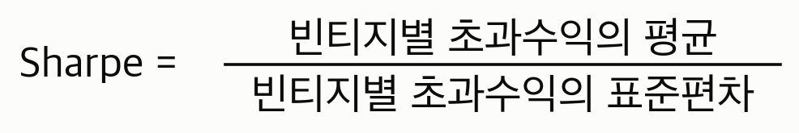
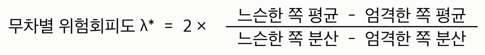
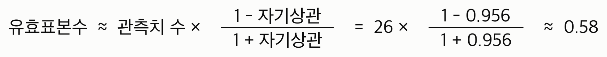

# Lending Club 대출 선별 규칙 — 위험조정 성과 보고서

각 장은 **설명 → 예시 → 그림 → 코드** 순서로 되어 있습니다. 수학 용어는 처음 나올 때 괄호로 풀어 쓰고, 부록에 다시 정리했습니다.

---

## 0. 한 장 요약

렌딩클럽에 들어온 대출 신청 중 **어떤 것을 승인해야 위험 대비 수익이 좋은가**를 판단하는 규칙을 만들고, 학습에 전혀 쓰지 않은 평가 데이터에 **한 번만** 적용해 측정했습니다.

최종 규칙은 두 겹입니다.

1. **등급 A~B에만 빌려준다**
2. 그중에서도 **모델이 예상한 수익이 국채 이자보다 높은 건만** 빌려준다

| | 자금 집행률 | 빈티지 평균 초과수익 | Sharpe | Sortino | 손실 빈티지 | 최악의 달 |
|---|---|---|---|---|---|---|
| 전량 투자 (현행) | 100% | 1.05% | **0.34** | 0.52 | 8/26 | −5.7% |
| **최종 규칙** | 57% | 1.13% | **0.84** | 1.87 | **5/26** | **−2.0%** |

빈티지 26개(2015-12~2018-01) 기준입니다. Sharpe가 **0.34 → 0.84**로 올랐고, 이 차이 **+0.50은 이 데이터가 낼 수 있는 가장 강한 증거 수준으로 0과 구별됩니다**(블록 부트스트랩 p<0.001).

가장 중요한 검정은 **승인률을 맞춘 무작위 대조군과의 비교**입니다. 같은 57%를 무작위로 골라도 Sharpe는 0.33에 그칩니다. 즉 성과는 "적게 빌려줘서"가 아니라 **"등급으로 골라서"** 나옵니다.

| 비교 | ΔSharpe | 95% 신뢰구간 | p값 | 평균 수익 차이 |
|---|---|---|---|---|
| 등급 선택 vs 동일 승인률 무작위 | **+0.51** | 0.42 ~ 1.85 | **<0.001** | **+0.54%p** (p<0.001) |

> **이 요약의 모든 p값에 대한 단서.** 위 p값은 1년 블록 부트스트랩으로 계산한 값인데, 관측치가 26개뿐이고 서로 강하게 닮아 있어(자기상관 0.96, 7장) 실질 정보량은 그보다 훨씬 적습니다. 따라서 "<0.001"은 **정확한 확률이 아니라 "이 표본이 낼 수 있는 증거 중 가장 강함"이라는 등급**으로 읽어야 합니다. 블록 길이를 바꿔도 결론이 뒤집히지 않는다는 점검은 7장에 있습니다.

**위험을 줄이면서 수익도 늘렸습니다.** 이것이 이 보고서에서 방어되는 유일한 성과입니다.

### 시도했으나 기각한 것, 그리고 미리 밝히는 한계

**1. 사이클 타이밍은 실패했습니다.** 신청자 구성으로 나쁜 해를 미리 읽어 자금을 줄이는 규칙을 만들어 검정했습니다. 기여는 **+0.008(p=0.737)**, 예측치와 실제 성적의 상관은 **0.034**입니다. 더 구체적으로, 이 규칙은 **가장 좋았던 달에 자금을 조이고 무너지는 동안 전액 집행했습니다**(5장, 그림 6). 최종 규칙에서 제외했습니다.

**2. 기계학습의 기여는 측정되지 않았습니다.** 시간 순서를 지켜 학습한 모델의 예측 상관은 **0.024**이고, 무위험 게이트는 자금의 **99.94%를 통과**시킵니다. 최종 규칙에서 실제로 일하는 것은 **렌딩클럽이 이미 무료로 공개하는 등급**입니다. 산출물은 정교한 모델이 아니라 "등급 A-B에 투자하라"이고, 이 보고서의 내용은 그 단순한 규칙이 왜 작동하는지, 그리고 **그 이상이 왜 안 되는지**를 측정한 것입니다.

**3. 절대 수준은 다중검정을 통과하지 못합니다.** 이 프로젝트는 **98개 설정**을 시도했습니다. 실력이 0이어도 98번 시도하면 최고값 0.645가 기대되는데, 관측값은 0.843입니다. **Deflated Sharpe 0.550**으로 통상 기준 0.95에 크게 못 미칩니다. **"Sharpe 0.84를 달성했다"는 주장은 성립하지 않습니다.** 방어되는 것은 위 표의 **차이**입니다.

**4. 등급 컷 A-B는 선택 기준에 민감합니다.** 무릎 판정 배수를 1.5·2.0배로 하면 A-B가, 3.0배로 하면 어떤 단계도 기준을 넘지 못해 아무것도 조이지 않는 결과가 됩니다. 이 기준은 λ* 패턴을 본 뒤 정했으므로 7장에 공개했습니다.

---

## 1. 무엇을 재는가 — 초과수익과 Sharpe

### 설명

대출 투자를 평가하려면 두 가지를 봐야 합니다. **얼마나 벌었나**, 그리고 **그 수익이 시기에 따라 얼마나 흔들렸나**.

첫 번째는 **초과수익률(ER, excess return)** 로 잽니다. 대출로 번 돈에서, 같은 돈을 미국 국채에 넣었다면 받았을 이자를 뺀 값입니다. 국채는 사실상 원금을 잃지 않으니, 위험을 감수한 대가가 실제로 있었는지를 보는 기준선이 됩니다.


두 번째는 **표준편차(standard deviation)** 로 잽니다. 여러 해의 성적이 평균에서 평균적으로 얼마나 벗어나는지를 하나의 숫자로 만든 것으로, 값이 클수록 해마다 들쭉날쭉했다는 뜻입니다.

이 둘을 나눈 것이 **Sharpe ratio(샤프 비율)** 입니다.



"위험 1단위를 감수해서 초과수익 몇 단위를 벌었나"를 뜻합니다. 값이 클수록 좋습니다.

여기서 **무엇을 한 단위로 세는지가 결정적입니다.** 개별 대출을 하나씩 세면 안 됩니다. 대출 30만 건을 한꺼번에 사면 개별 차주의 사정은 서로 상쇄되어 거의 사라지기 때문에, 그렇게 계산한 값은 "이 대출이 저 대출보다 위험한가"만 재고 실제로 투자자가 겪는 위험을 재지 못합니다.

그래서 **같은 달에 발행된 대출 묶음을 한 단위로** 셉니다. 이 묶음을 **빈티지(vintage)** 라고 부릅니다. 와인처럼 "몇 년산이냐"가 성적을 좌우하기 때문입니다. 이렇게 세면 Sharpe는 이런 질문에 답하게 됩니다 — **"내가 언제 대출을 시작했는지에 따라 성적이 얼마나 달라지는가."** 대출기관을 실제로 망가뜨리는 위험이 바로 이것입니다.

### 예시

두 대출기관이 3년간 각각 이런 성적을 냈다고 합시다.

| | 1년차 | 2년차 | 3년차 | 평균 | 표준편차 | Sharpe |
|---|---|---|---|---|---|---|
| A사 | +3% | +3% | +3% | 3% | 0% | 매우 큼 |
| B사 | +12% | −9% | +6% | 3% | 11% | 0.27 |

평균 수익은 똑같이 3%입니다. 하지만 B사는 2년차에 9%를 잃었습니다. 같은 3%를 벌었어도 B사 쪽이 훨씬 위험한 사업이고, Sharpe는 그 차이를 잡아냅니다.

### 그림


이 그림이 이 보고서의 모든 Sharpe 값이 계산되는 원자료입니다. 주황색은 모든 대출에 투자했을 때, 파란색은 최종 규칙(6장의 ②)을 적용했을 때 **그 달에 나간 대출들이 최종적으로 거둔 초과수익**입니다.

두 선의 **높이 평균**이 Sharpe의 분자, **위아래로 흔들리는 폭**이 분모입니다. 2017년 중반부터 두 선이 모두 0 아래로 내려가지만, 주황색은 −5.7%까지 떨어지고 파란색은 −2.0%에서 멈춥니다. 최종 규칙은 나쁜 시기를 **피하지는 못했고, 얕게 지나갔습니다.**

> **정오 기록**: 이 보고서의 초고는 그림 7의 파란 선으로 기각된 전략 ③(타이밍 포함, 최악의 달 −1.6%)의 계열을 "최종 규칙"이라는 이름으로 그리는 오류가 있었습니다. 현재 그림은 실제로 최종인 ②(최악의 달 −2.0%)의 계열입니다. 숫자가 초고보다 나빠지는 방향의 수정이므로 그대로 반영했습니다.

### 코드

[src/metrics.py](src/metrics.py) — 빈티지 한 줄을 만드는 계산입니다. 거절한 자금은 사라지는 게 아니라 국채로 가므로, 승인률을 곱해줍니다.

```python
# 승인률 a, 대출 수익률 y, 국채 수익률 rf
out["loan_excess"] = np.where(out["accept_rate"] > 0, out["loan_irr"] - out["rf"], 0.0)
out["excess"] = out["accept_rate"] * out["loan_excess"]   # 초과수익 = a × (y − rf)
out["blended_return"] = out["rf"] + out["excess"]
```

이 식에는 중요한 성질이 하나 있습니다. **승인률이 일정하면 Sharpe는 변하지 않습니다.** 분자와 분모가 똑같은 비율로 줄기 때문입니다. 그래서 "그냥 조금만 빌려주기"로는 Sharpe를 올릴 수 없고, **승인률이 시기에 따라 변할 때만** 효과가 생깁니다. 5장에서 이 성질에 기대어 타이밍 규칙을 만들었고, 실패했습니다.

---

## 2. 데이터를 시간 순서로 나눈다

### 설명

모델을 만들 때 흔히 하는 실수는 **성적을 재는 데 쓴 데이터로 결정을 내리는 것**입니다. 그러면 그 성적은 실력이 아니라 정답을 미리 본 결과가 됩니다.

이 프로젝트는 데이터를 두 파일로 완전히 분리했습니다.

- `lending_club_2020_train.csv` — 개발에만 사용. 여기서 모델을 학습시키고, 세 가지 규칙을 모두 결정합니다.
- `lending_club_2020_test.csv` — **규칙이 다 정해진 뒤 딱 한 번** 열어서 최종 성적만 냅니다.

그리고 개발용 파일을 다시 **시간 순서로** 셋으로 나눴습니다. 비율은 6:2:2입니다.

- **train** — 모델이 배우는 구간
- **valid** — 모델 학습을 언제 멈출지 정하는 구간. XGBoost 같은 모델은 나무를 계속 더하면 학습 데이터에만 맞춰지므로, 학습에 쓰지 않은 구간에서 성적이 더 이상 좋아지지 않는 시점에 멈춰야 합니다.
- **선택** — 등급 컷, 게이트, 타이밍 규칙을 **결정하는** 구간. 코드에서는 관례대로 `test`라고 부르지만, 최종 성적을 재는 `lending_club_2020_test.csv`와 혼동을 막기 위해 이 보고서에서는 **선택 블록**이라고 부릅니다. 이 블록은 성적을 재지 않고 **고르기만** 합니다.

나누는 기준을 대출 건수가 아니라 **빈티지 개수**로 했습니다. 렌딩클럽 물량이 후반에 몰려 있어서 건수로 6:2:2를 하면 마지막 블록이 15개월밖에 안 됩니다. 15개월로는 Sharpe의 분모(빈티지 간 변동)를 잴 수 없습니다.

### 예시

시험 공부에 비유하면 이렇습니다. **train**은 교과서, **valid**는 "이제 그만 공부해도 되겠다"를 판단하는 모의고사, **선택 블록**은 어떤 유형을 풀고 어떤 유형을 건너뛸지 전략을 정하는 기출문제입니다. 그리고 `lending_club_2020_test.csv`가 실제 시험입니다. 실제 시험 문제를 미리 보고 전략을 짜면 점수는 높게 나오지만 실력은 아닙니다.

### 그림


train 블록은 기간이 6년이나 되는데 대출은 9만 건뿐입니다. 렌딩클럽이 초기에는 규모가 작았기 때문입니다. 반대로 선택 블록은 2년 남짓인데 37만 건입니다.

### 코드

[src/split.py](src/split.py)

```python
def vintage_boundaries(df, train_frac=0.60, valid_frac=0.20):
    """블록이 바뀌는 두 발행월."""
    months = np.sort(df["issue_month"].unique())
    i_train = int(round(len(months) * train_frac))
    i_valid = int(round(len(months) * (train_frac + valid_frac)))
    return pd.Timestamp(months[i_train]), pd.Timestamp(months[i_valid])
```

[src/pipeline.py](src/pipeline.py) — 개발과 최종 평가 사이의 벽입니다.

```python
def develop(rf_table):
    (tr, va, te), blocks, df_all = load_blocks(rf_table)   # train CSV만
    art = model.fit(tr, va)                                # train으로 학습, valid로 중단
    te["ER_hat"] = model.predict(*art, te)
    ...                                                    # 모든 규칙을 te에서 결정
    return frozen, dev                                     # 규칙을 얼려서 반환
```

---

## 3. 무작위로 섞으면 성적이 부풀려진다

### 설명

앞 장에서 데이터를 **시간 순서로** 나눈다고 했습니다. 왜 그냥 무작위로 섞지 않는지가 이 프로젝트에서 가장 큰 숫자 차이를 만듭니다.

렌딩클럽의 대출 품질은 시기에 따라 크게 변했습니다. 2013년에 빌려준 1달러는 국채보다 약 10% 더 벌었지만, 2018년에 빌려준 1달러는 국채보다 5% 손해였습니다. 이때 데이터를 무작위로 섞으면 **같은 달에 발행된 대출이 학습과 평가 양쪽에 들어갑니다.**

그러면 모델은 "어떤 차주가 위험한가"를 배우는 대신 **"2016년의 부도율이 대략 얼마인가"를 외웁니다.** 평가할 때도 같은 2016년 대출을 보니 성적이 좋게 나오지만, 실제 대출기관은 2016년의 부도율을 2016년에 알 수 없습니다.

이런 종류의 오염을 **누출(leakage)** 이라고 합니다. 날짜 열을 모델에 넣지 않았어도 일어납니다. 모델이 금리·FICO·부채비율의 조합을 통해 간접적으로 시기를 알아내기 때문입니다.

### 예시

전국 모의고사 문제를 반별로 무작위로 나눠 절반은 미리 풀어보고 절반으로 시험을 본다면, 문제 유형이 겹쳐서 점수가 잘 나옵니다. 하지만 진짜 시험은 **다음 회차** 문제로 치릅니다. 시간 순서로 나눈다는 건 "다음 회차로 시험 본다"는 뜻입니다.

### 그림


같은 모델, 같은 변수, 같은 평가 대상, 같은 최종 규칙(6장의 ②)입니다. 데이터를 나누는 방식만 바꿨습니다.

- **예측 정확도**(예측값과 실제 수익의 상관계수, −1~1 사이의 값으로 1에 가까울수록 잘 맞힌다는 뜻): 0.024 → 0.387, **16배**
- **최종 Sharpe**: 0.84 → 1.32

즉 문헌에서 흔히 보이는 높은 성적의 상당 부분은 실력이 아니라 이 누출입니다. 이 보고서는 0.387이 아니라 **0.024를 정직한 값으로 보고**하고, 1.32는 "도달할 수 없는 상한"으로만 표에 남겨 둡니다.

### 코드

[src/model.py](src/model.py) — 학습 중단 시점조차 미래를 보지 않게 합니다.

```python
def fit(df_fit, df_valid=None, safe_only=True):
    if df_valid is not None and len(df_valid):
        df_a, df_b = df_fit, df_valid          # 정직: valid는 train보다 뒤 시기
    else:
        idx_tr, idx_es = train_test_split(...)  # 누출 진단용 경로
        df_a, df_b = df_fit.loc[idx_tr], df_fit.loc[idx_es]
```

변수 선택에도 같은 원칙이 적용됩니다. 렌딩클럽이 2015~2016년부터 수집을 시작한 신용조회 항목 약 50개는 그 이전 대출에서 100% 결측입니다. 나무 모델은 **"이 값이 비어 있는가"를 거의 완벽한 시계처럼** 읽을 수 있어서, 날짜를 안 줘도 시기를 알아냅니다. 그래서 결측률이 시기별로 30%p 이상 변하는 변수는 모두 제외했습니다 ([config.py의 `SAFE_FEATURE_COLS`](src/config.py)).

---

## 4. 어디까지 빌려줄 것인가

### 설명

렌딩클럽은 자체 심사로 대출에 A부터 G까지 등급을 매깁니다. A가 가장 안전하고 G가 가장 위험합니다. 위험한 등급은 금리를 더 받으니, 어디까지 내려갈지는 선택의 문제입니다.

여기서 두 가지를 결합했습니다.

**첫째, 등급 컷.** A까지만, A~B까지, A~C까지… 일곱 가지 후보를 모두 선택 블록에서 측정했습니다.

**둘째, 무위험 게이트.** 모델이 예측한 초과수익이 0보다 큰 건만 빌려줍니다. "국채보다 못 벌 것 같으면 빌려주지 않는다"는 자명한 논리이고, 무엇보다 **조절할 값이 없습니다.** 몇 %가 통과될지는 결과일 뿐 목표가 아니므로, 값을 이리저리 맞춰보다가 우연히 좋아 보이는 조합을 고르는 일이 원천적으로 불가능합니다.

그런데 어느 등급에서 멈춰야 할까요? "Sharpe가 가장 높은 곳"은 답이 아닙니다. 등급을 조일수록 Sharpe는 계속 오르는데, A만 사면 자금의 24%만 집행하고 초과수익은 0.45%로 쪼그라듭니다. Sharpe는 규모를 보지 않는 지표라서 **"거의 안 빌려주기"에 벌점을 주지 않습니다.**

그래서 **얼마를 내고 얼마를 얻는지**를 명시적으로 계산했습니다. 위험을 싫어하는 정도를 λ(람다)라고 하고, 만족도를 이렇게 씁니다.


두 선택지의 만족도가 같아지는 λ를 풀면 이렇게 나옵니다.



이 λ*는 **한 단계 더 조이는 데 붙은 가격표**입니다. 내 λ가 λ*보다 크면(= 위험을 그만큼 싫어하면) 조이는 게 낫고, 작으면 그대로 두는 게 낫습니다. λ를 아무도 정하지 않아도, **λ*가 갑자기 튀는 지점**을 보면 어디서 멈춰야 할지 알 수 있습니다.

### 예시

물건값에 비유하면 이렇습니다. 1단계마다 "위험 감소"라는 상품을 사는데, λ*는 그 가격입니다. 처음 몇 단계는 공짜거나 심지어 돈을 받으면서 살 수 있습니다(수익이 오히려 늘어남). 그러다 어느 단계에서 가격이 갑자기 6배로 뛰면, 거기서 장바구니를 닫는 게 합리적입니다.

### 그림


이 그림의 숫자는 **개발 단계, 즉 선택 블록에서 잰 값**입니다. 6장의 최종 평가는 달력은 같지만 **완전히 다른 대출들**이므로 Sharpe가 조금 다릅니다(예: A-G가 여기서는 0.38, 최종 평가에서는 0.34). 두 숫자를 대조하다 어긋난다고 느꼈다면 그것이 정상입니다.

왼쪽에서 A-G(전량)부터 A까지 왼쪽 아래로 내려가는 곡선이 보입니다. **위험이 수익보다 먼저 줄어듭니다.** A-G에서 A-C까지는 위험이 3.0% → 2.3%로 줄면서 수익은 1.12% → 1.33%로 **오히려 늘어납니다.** 그 뒤로는 수익도 함께 떨어집니다.


가격표가 명확합니다. A-G에서 A-C까지는 λ*가 −44, −59, −24, −6으로 **음수이거나 아주 작습니다.** 음수라는 건 조이는데 수익이 오히려 늘었다는 뜻이므로, 위험 선호와 무관하게 **무조건 조이는 게 이득**입니다. 등급 F와 G는 버리는 게 정답입니다.

그러다 A-C → A-B에서 14, **A-B → A에서 79로 튑니다.** 마지막 단계가 앞 단계보다 6배 비쌉니다. 그래서 **A-B가 멈출 곳**입니다.

한 가지는 정직하게 밝혀야 합니다. **무위험 게이트는 단독으로는 거의 아무 일도 하지 않습니다.** 전량 투자의 Sharpe 0.3746이 게이트만 걸면 0.3754가 됩니다. 모델이 자금의 99.94%를 "국채보다 낫다"고 판정하기 때문입니다. 게이트는 논리적으로 옳고 조절 값이 없다는 장점이 있지만, **실제로 성과를 만든 것은 등급 컷입니다.**

### 코드

[src/pipeline.py](src/pipeline.py)

```python
def indifference_lambda(er_loose, er_tight):
    dmu = er_loose.mean() - er_tight.mean()
    dvar = er_loose.var(ddof=1) - er_tight.var(ddof=1)
    return float(2 * dmu / dvar) if dvar != 0 else np.nan

# 무릎: 앞 단계들의 가격을 뚜렷하게 넘어서는 첫 단계 직전에서 멈춘다
cut = order[int(np.argmax(lam["lambda*"].to_numpy() > 2 * np.median(
    np.abs(lam["lambda*"].to_numpy()))))]
```

---

## 5. 나쁜 해를 신청서로 읽으려 했으나 실패했다

### 설명

4장까지는 **"어떤 대출을 고를까"** 였습니다. 그런데 그림 7에서 보듯 2017년 이후 빈티지는 **등급을 아무리 조여도 나빴습니다.** 하나의 신용 경기가 모든 등급을 같이 끌어내리기 때문에, 횡단면 선택으로는 나쁜 해의 **크기**만 줄이고 **개수**는 못 줄입니다.

나쁜 해의 개수를 줄이려면 **시기를 읽어야** 합니다. 그런데 3년 만기 대출의 결과는 3년 뒤에나 확정되니, 대출기관은 그 해가 나쁠지 모릅니다.

그래서 **신청자 풀의 구성**을 써봤습니다. 이번 달 지원자의 평균 부채비율·금리·신용점수는 **신청서에 적혀 있으므로 대출 실행 당일 손에 있습니다.** 지연이 0입니다. 작동 방식은 이렇습니다.

1. **이미 만기가 끝난 빈티지**만 골라 "신청자 구성이 이러했을 때 결과가 저러했다"는 관계를 추정합니다. 이때 **릿지 회귀(ridge regression)** — 변수 수에 비해 관측치가 적을 때 계수가 과도하게 커지는 것을 억제하는 회귀 — 를 씁니다.
2. 그 관계를 **이번 달 신청자 구성**에 적용해 예상 성적을 냅니다.
3. 그 예상치를 **학습 기간의 정상 수준**과 비교해, 나빠 보이는 만큼 이번 달 자금을 줄입니다.

결정 시점 이후의 정보는 어디에도 쓰이지 않습니다.

### 예시

식당 주인이 재료를 얼마나 준비할지 정하는 것과 같습니다. 오늘 손님이 몇 명 올지는 모르지만, 예약 전화 수와 날씨는 아침에 알 수 있고 과거 경험이 쌓여 있습니다. 문제는 그 경험이 **올해도 통하는가**입니다.

### 결과 — 기각

**작동하지 않았습니다.** 애매하게가 아니라 분명하게 실패했습니다.

| | 값 |
|---|---|
| 타이밍 기여 (같은 평균 승인률·시간불변 대조군 대비) | **+0.008** |
| 95% 신뢰구간 | −0.053 ~ 0.043 |
| p값 | **0.737** |
| 예측치와 실제 성적의 상관 | **0.034** |

### 그림


위아래 두 칸이 같은 시간축입니다. **규칙이 조인 시점과 실제로 나빴던 시점이 어긋나 있습니다.**

- **2015-12 ~ 2016-06**: 자금을 69~88%로 조였습니다. 그런데 이 달들은 실제로 **+2.2~+3.0%로 좋았습니다.**
- **2016-10 ~ 2017-09**: 자금을 **100% 전액 집행**했습니다. 그런데 이 구간에서 성적이 **+3.8% → −3.1%로 무너집니다.**
- 2017-10 이후에야 조이기 시작하는데, 이미 늦었습니다.

즉 이 규칙은 **가장 좋았던 달에 몸을 사리고, 무너지는 동안 전액을 밀어 넣었습니다.**

### 왜 실패했는가

신청자 풀을 보면 부채비율은 10년간 올랐지만(13.4 → 19.3), 신용점수는 오히려 **좋아졌고**(694.8 → 711.3) 금리는 **내려왔습니다**(12.2% → 11.3%). 통상적인 신용 지표만으로는 2017년의 악화가 예고되지 않았습니다.


더 근본적인 이유가 있습니다. 회귀식이 학습한 관계는 **2007~2015년의 관계**입니다. 그런데 2017년에 나간 대출의 성적을 결정한 것은 그 대출들이 만기를 맞는 **2020년의 상황**이고, 신청서에는 그 정보가 없습니다. 명세를 고쳐서 해결될 문제가 아닙니다.

> **기록으로 남기는 이유**: 이 규칙의 최초 명세에는 오류가 있었습니다. "정상 수준"의 기준점을 학습 기간이 아니라 **평가 구간 자체의 앞부분**에서 만들어, 다이얼이 26개월 중 22개월 동안 100%에 붙어 있었습니다. 그때 측정된 기여 +0.048(p=0.256)은 타이밍의 검정이 아니라 **거의 아무것도 하지 않는 규칙의 검정**이었습니다. 기준점을 바로잡아 15개월에서 작동하게 만든 뒤 다시 재니 +0.008(p=0.737)이 나왔습니다. **명세를 고치자 결과가 좋아지지 않고 실패가 분명해졌습니다.** 이 재명세도 시도 횟수(98회)에 반영했습니다.

### 코드

[src/timing.py](src/timing.py) — 결정 시점 이후를 읽지 않도록 하는 부분입니다.

```python
for i, d in enumerate(n_idx):
    # d 시점에 이미 만기가 끝난 빈티지만 사용
    known = (h_idx <= d - pd.DateOffset(months=term_months)) & np.isfinite(yh)
    if known.sum() < min_fit:
        continue                       # 이력이 부족하면 보정하지 않는다
    out[i] = float(_ridge(Xh[known], yh[known])(Xn[i:i + 1])[0])
```

기준점을 학습 기간 전체로 옮긴 수정입니다.

```python
fc_hist = forecast(dial_fit["pool"], dial_fit["realised"], term_months)
fc_new  = forecast_from(dial_fit, pool_new, term_months)
combined = pd.concat([fc_hist, fc_new]).sort_index()
dial = acceptance_dial(combined)      # 과거 예측치 약 100개가 기준이 된다
```

---

## 6. 최종 결과

### 설명

규칙을 모두 얼린 뒤 `lending_club_2020_test.csv`를 한 번 열어 적용했습니다. 36개월 대출, 2015-12~2018-01 발행분 **246,009건, 빈티지 26개**입니다.

여기서 가장 중요한 것은 **대조군 설계**입니다. Sharpe가 올랐다는 사실만으로는 무엇 덕분인지 알 수 없기 때문에, 두 개의 대조군을 붙였습니다.

- **⑤ 동일 승인률 무작위** — 같은 승인률로 대출을 **무작위로** 고릅니다. 적게 빌려주기만 해도 저절로 생기는 효과를 가격표로 매깁니다. **최종 규칙의 성과를 판정하는 기준선이 이것입니다.**
- **④ 동일 평균승인률·시간불변** — 평균 승인률은 같지만 그 승인률을 시기에 따라 바꾸지 않습니다. ③과 ④의 차이는 **"나쁜 해에 적게 빌려준 것"만** 담습니다. 5장에서 기각한 타이밍 규칙을 판정하는 데 쓰였습니다.

### 예시

"약을 먹고 나았다"만으로는 약효를 알 수 없습니다. 아무것도 안 한 집단(①), 가짜 약을 먹은 집단(⑤), 약은 먹었지만 복용 시점을 조절하지 않은 집단(④)이 있어야 무엇이 효과를 냈는지 분리됩니다.

### 그림 — 최종 사다리


| | 집행률 | 평균 초과수익 | Sharpe | Sortino | 손실 빈티지 | 최악의 달 |
|---|---|---|---|---|---|---|
| ① 전량 투자 | 100% | 1.05% | 0.34 | 0.52 | 8/26 | −5.7% |
| ⑤ 동일 승인률 무작위 | 57% | 0.59% | **0.33** | 0.51 | 8/26 | −3.4% |
| **② 등급 A-B × 게이트 (최종)** | 57% | **1.13%** | **0.84** | **1.87** | **5/26** | **−2.0%** |
| ③ ② + 타이밍 (기각) | 53% | 1.10% | 0.90 | 2.15 | 5/26 | −1.6% |
| ④ 동일 평균승인률·시간불변 | 55% | 1.12% | 0.89 | 2.07 | 5/26 | −1.7% |
| ⑥ 무작위분할 모델 (도달불가) | 53% | 1.32% | 1.32 | 5.49 | 3/26 | −0.8% |

읽는 순서가 중요합니다.

**⑤가 0.33입니다.** 전량 투자 0.34와 사실상 같습니다. 즉 **"적게 빌려주는 것" 자체로는 Sharpe가 전혀 오르지 않습니다.** 오히려 수익만 1.05% → 0.59%로 깎입니다. 1장에서 본 항등식이 실제로 확인된 것입니다.

**②가 0.84입니다.** 같은 승인률인데 무작위 대신 등급으로 골랐더니 0.33 → 0.84가 됐습니다. 이것이 **선택의 순수 기여**이고, 이 보고서에서 방어되는 유일한 성과입니다.

**③이 0.90, ④가 0.89입니다.** 타이밍을 얹으면 숫자가 조금 오르지만, 평균 승인률이 같고 시간에 따라 변하지 않는 ④와 비교하면 차이가 거의 없습니다. 5장에서 기각한 이유입니다.

**⑥이 1.32입니다.** 데이터를 무작위로 섞었을 때 나오는 값이고 도달할 수 없습니다. 정직한 0.84는 그 64% 수준입니다.

### 그림 — 차이가 0과 구별되는가

점추정치만으로는 아무것도 주장할 수 없으므로, 네 개 비교에 각각 **부트스트랩 신뢰구간과 p값**을 붙였습니다. 같은 블록 인덱스로 두 계열을 함께 재추출해 빈티지 간 짝을 보존합니다.


| 비교 | ΔSharpe | 95% 신뢰구간 | p값 | 차분 유효표본수 |
|---|---|---|---|---|
| 최종 규칙 vs 전량 투자 | **+0.50** | 0.41 ~ 1.79 | **<0.001** | 0.36 |
| **최종 규칙 vs 동일 승인률 무작위** | **+0.51** | 0.42 ~ 1.85 | **<0.001** | 1.10 |
| 타이밍 (③ vs ④ 시간불변) | +0.008 | −0.05 ~ 0.04 | **0.737** | 2.11 |
| 최종 규칙 vs 무작위분할 상한 | −0.48 | −0.73 ~ −0.41 | 0.039 | 1.40 |

표를 자세히 본 독자는 이상한 점을 발견했을 것입니다. **점추정치 +0.50이 신뢰구간(0.41~1.79)의 하한 쪽에 붙어 있습니다.** 이것은 추정이 아래로 취약하다는 뜻이 아닙니다. 부트스트랩 분포의 **중위값은 0.50으로 점추정치와 일치**하고, 구간을 위로 끌어올리는 것은 긴 오른쪽 꼬리입니다(왜도 5.2, 재추출의 7%가 +1.0 초과). 우연히 조용한 달들만 뽑힌 재추출에서는 최종 규칙의 분모(변동성)가 아주 작아져 Sharpe 차이가 위로 폭발하기 때문입니다. 요컨대 이 비대칭은 "차이가 더 클 수도 있다"는 쪽의 불확실성이며, 동시에 **분모가 이렇게 쉽게 흔들린다는 것 자체가 소표본 경고**입니다.

**선택은 유의하고, 타이밍은 유의하지 않습니다.**

선택의 기여는 부트스트랩 p<0.001입니다. 평균 초과수익 자체도 무작위 대조군보다 **0.54%p 높고 대응 HAC 검정 p<0.001**로 유의합니다. 즉 등급으로 고르는 것은 **위험을 줄이면서 동시에 수익을 늘립니다.** 위험을 줄이려고 수익을 팔았다는 비판은 성립하지 않습니다.

타이밍의 기여는 신뢰구간이 0을 포함하고 p=0.737입니다.

**차분 유효표본수 열도 함께 보십시오.** 두 전략은 같은 26개월을 함께 겪으므로 차이를 먼저 계산하면 공통 경기 변동이 상쇄됩니다. 그런데 그 효과가 비교마다 다릅니다 — 무작위 대조군과의 비교는 0.36 → 1.10으로 개선되지만, 전량 투자와의 비교는 0.36에 머뭅니다. 두 계열이 거의 평행하게 움직여 차분에도 추세가 남기 때문입니다. **차분이 항상 표본을 되살려주지는 않습니다.**

### 코드

[src/pipeline.py](src/pipeline.py) — 대조군 두 개가 만들어지는 부분입니다.

```python
w_final = timing.weights(df, "ER_hat", dial, in_grade & gate)
r_fin, er_fin = measure(df, w_final, rf_table, "③ ② + 풀구성 타이밍 (기각)", base_er)

# ③과 평균 승인률은 같고, 시간에 따라 변하지 않는 대조군
flat = pd.Series(r_fin["집행률"] / max(r2["집행률"], 1e-9), index=dial.index)
r, _er = measure(df, timing.weights(df, "ER_hat", flat, in_grade & gate),
                 rf_table, "④ 동일 평균승인률·시간불변 (타이밍 대조군)", base_er)

# 최종 규칙 ②와 같은 승인률로 무작위 선택 — 씨앗 20개 평균
rand = [measure(df, rules.w_random_at_rate(df, r2["집행률"], seed), rf_table,
                "⑤ 동일 승인률 무작위", base_er)[0] for seed in range(20)]
```

---

## 7. 이 숫자를 얼마나 믿을 수 있는가

### 설명

Sharpe 0.84는 **점추정치**입니다. 즉 "가장 그럴듯한 하나의 값"일 뿐, 참값이 정확히 그것이라는 뜻은 아닙니다. 이 보고서는 그 불확실성도 함께 측정했습니다.

핵심 문제는 **자기상관(autocorrelation)** 입니다. 인접한 달의 성적이 서로 얼마나 닮았는지를 −1~1로 나타낸 값인데, 여기서는 **0.956**입니다. 옆 달과 거의 같다는 뜻입니다.

그러면 26개 빈티지는 서로 독립된 26개의 관측이 아닙니다. **유효표본수(effective sample size)** 로 환산하면 이렇습니다.



**26개월 데이터의 실질 정보량이 1개 관측치에도 못 미칩니다.** 신용 경기가 천천히 움직이기 때문에, 몇 년을 모아도 "경기 사이클을 한 번 봤다"는 것 이상이 되지 않습니다.

이 0.956에는 신용 경기 말고 **기계적인 이유**도 섞여 있습니다. 36개월 만기 대출을 매달 발행하므로, 인접한 두 빈티지는 상환이 진행되는 36개월 중 **35개월을 공유**합니다. 2020년의 충격은 2017년 3월 빈티지와 4월 빈티지를 거의 같은 비중으로 때립니다. 옆 달과 닮는 것은 경기가 느려서이기도 하지만 **측정 창이 겹쳐서**이기도 하고, 이 데이터로는 두 몫을 분리할 수 없습니다. 유효표본수 0.58은 그 둘을 합쳐서 읽어야 하는 숫자입니다.

이 때문에 **신뢰구간(confidence interval)** 이 매우 넓습니다. 0.22~4.92입니다. 계산에는 **블록 부트스트랩(block bootstrap)** 을 썼습니다. 데이터를 통째로 재추출해 성적을 수천 번 다시 계산하는 방법인데, 인접 달이 닮아 있으므로 한 개씩 뽑는 대신 **1년치 덩어리로** 뽑아 그 구조를 보존합니다.

블록 부트스트랩 자체에도 밝혀야 할 한계가 있습니다. 26개 관측치를 평균 12개월 블록으로 뽑으면 한 번의 재추출은 사실상 **독립 블록 2개 남짓**으로 조립됩니다. 이런 조건에서 "95% 신뢰구간"의 명목 포함확률이 실제로 지켜진다는 보장은 없습니다. 블록 길이도 저자가 고른 값이므로, 바꿨을 때 결론이 움직이는지 함께 공개합니다.

| 평균 블록 | ΔSharpe(② vs ①) 95% 구간 | p | ②의 Sharpe 95% 구간 |
|---|---|---|---|
| 6개월 | 0.40 ~ 2.84 | <0.001 | 0.14 ~ 8.92 |
| **12개월 (본문)** | 0.41 ~ 1.79 | <0.001 | 0.22 ~ 4.92 |
| 18개월 | 0.42 ~ 1.67 | <0.001 | 0.25 ~ 4.75 |

구간의 **폭**은 블록 길이에 따라 크게 출렁입니다 — 절대 수준을 못 박을 수 없다는 뜻입니다. 그러나 **차이의 하한이 0 위에 있다는 사실은 어느 블록 길이에서도 움직이지 않습니다.** "차이는 방어되고 수준은 방어되지 않는다"는 이 보고서의 결론과 같은 모양입니다.

**PSR(Probabilistic Sharpe Ratio)** 도 함께 냈습니다. 왜곡된 분포를 감안해 "참 Sharpe가 0보다 클 확률"을 계산한 값으로, 최종 규칙은 **0.717**입니다. 통상 기준(0.95)에는 못 미칩니다.

### 그림

그림 8의 왼쪽 패널에서 각 점 옆의 **회색 막대가 신뢰구간**입니다. 막대들이 서로 크게 겹칩니다. 이것이 "Sharpe가 0.84다"를 주장할 수 없는 이유를 시각적으로 보여줍니다.

### 그래서 무엇이 방어되는가

절대 수준은 방어되지 않습니다. 여기에 두 가지 이유가 더해집니다.

**다중검정.** 이 프로젝트는 결론에 이르기까지 **98개 설정**을 시도했습니다 — 등급 컷 7, 만기 2, 수준 재보정 3, 평가창 시작점 7, 모델 분할 3, 버킷 배분 1, 프론티어 조합 51, 현금흐름 타이밍 4, K 스윕 19, 타이밍 규칙 재명세 1. 여러 번 시도하면 그중 최고값은 실력이 없어도 어느 정도 올라가므로, 그 기대치를 기준선으로 삼아 보정한 것이 **Deflated Sharpe**입니다.

| 항목 | 값 |
|---|---|
| 반영한 시도 횟수 | 98 |
| 시도 간 Sharpe 분산 | 0.065 |
| 실력이 0일 때 기대되는 최고 Sharpe | **0.645** |
| 관측된 Sharpe | 0.843 |
| **Deflated Sharpe** | **0.550** |

통상 기준 0.95에 크게 못 미칩니다. **98번 시도한 끝에 얻은 0.84는, 아무 실력 없이 98번 시도했을 때 기대되는 0.645보다 조금 높을 뿐입니다.**

**사후에 정한 선택 기준.** 등급 컷을 고른 무릎 규칙 — "λ*가 앞 단계들 중위 절대값의 2배를 넘는 첫 지점 직전에서 멈춘다" — 의 **2배라는 숫자는 λ* 패턴을 본 뒤에 정했습니다.** 다른 배수에서 무엇이 선택되는지를 함께 공개합니다.

| 배수 | 선택된 등급 컷 |
|---|---|
| 1.5배 | A-B |
| 2.0배 | A-B |
| 3.0배 | 어떤 단계도 기준 미달 → 아무것도 조이지 않음 |

1.5배와 2.0배는 같은 답을 주지만 3.0배에서는 규칙이 무너집니다. **A-B라는 결론은 이 기준에 의존합니다.**

### 그럼에도 남는 것

**비교**는 다릅니다. 두 전략은 같은 26개월을 함께 겪으므로, 성적을 **먼저 뺀 다음** 차이를 검정하면 공통 경기 변동이 상쇄됩니다. 6장 표가 그 결과이고, 요약하면 이렇습니다.

- **등급 선택의 기여 +0.51 (p<0.001)** — 방어됨. 평균 수익도 동시에 0.54%p 높음 (p<0.001)
- **전량 투자 대비 전체 +0.50 (p<0.001)** — 방어됨
- **타이밍의 기여 +0.008 (p=0.737)** — 방어되지 않음. 기각
- **손실 빈티지 8/26 → 5/26, 최악의 달 −5.7% → −2.0%** — 관측치가 각각 3개 차이와 1개씩이므로 방향의 참고로만 읽어야 함

다만 **"차분하면 표본 문제가 해결된다"고 말할 수는 없습니다.** 6장에서 본 대로 차분 유효표본수는 비교에 따라 0.36에서 2.11까지 흩어집니다. n=26에서 HAC 표준오차 자체도 불안정하므로, 위 p값들은 **정확한 확률이 아니라 증거의 등급**으로 읽는 것이 옳습니다.

### 남은 한계

1. **평가 창이 규칙을 고른 창과 달력이 겹칩니다.** 대출은 완전히 다르지만 시기(2015-12~2018-01)는 같습니다. 데이터가 2018-01에서 끝나므로 새로운 시기를 떼어낼 방법이 없습니다.
2. **평가 창에 신용 위기가 없습니다.** 2007~2009년 위기는 이 데이터에서 전체 자금의 0.4%에 불과합니다. 위기 국면에서의 성능은 검증되지 않았습니다.
3. **타이밍은 이 데이터에서 불가능해 보입니다.** 신청서 정보로 3년 뒤 만기 시점의 상황을 예고할 수 없습니다. 명세 오류를 고친 뒤에도 예측 상관은 0.034였습니다.
4. **소표본 지표를 과신하면 안 됩니다.** Sortino의 분모(하방편차)는 음수 빈티지 **5개**로 추정되고, 최악의 달은 양쪽 모두 **관측치 1개**입니다. 0.52 → 1.87 같은 값은 자리수만큼의 정밀도를 갖지 않습니다.
5. **기계학습의 기여는 측정되지 않았습니다.** 예측 상관 0.024, 게이트 통과율 99.94%. 최종 규칙에서 일하는 것은 렌딩클럽 등급입니다. 이것은 실패가 아니라 이 데이터에 대한 결과이지만, "모델을 만들었다"고 서술할 수는 없습니다.
6. **60개월 대출은 결론에서 제외했습니다.** 2021-01 스냅샷 기준 완전만기 조건 때문에 2016년 이후 발행분이 통째로 빠지고, 그 결과 2017~2018년 악화기를 겪지 않습니다. 섞으면 계열의 구성이 중간에 바뀌고, 따로 보면 정작 중요한 구간이 없습니다. 평균을 내는 것보다 제외하고 그 이유를 밝히는 편이 낫다고 판단했습니다.

---

## 부록. 수학·통계 용어 정리

| 용어 | 뜻 |
|---|---|
| **초과수익률 (ER)** | 대출 수익에서 같은 기간 국채 이자를 뺀 값. 위험을 감수한 대가가 실제로 있었는지의 기준 |
| **빈티지 (vintage)** | 같은 달에 발행된 대출 묶음. 이 보고서의 관측 단위 |
| **표준편차 (σ)** | 값들이 평균에서 평균적으로 얼마나 벗어나는지. 클수록 들쭉날쭉함 |
| **분산 (σ²)** | 표준편차의 제곱. 계산에서 다루기 편해 자주 쓰임 |
| **Sharpe ratio** | 평균 초과수익 ÷ 표준편차. 위험 1단위당 벌어들인 초과수익 |
| **Sortino ratio** | Sharpe의 분모를 **하방 변동만**으로 바꾼 것. 왼쪽 꼬리가 두꺼운 자산에 더 적합 |
| **IRR** | 현금이 들어오고 나간 시점까지 반영해 계산한 연 수익률 |
| **상관계수** | 두 값이 같이 움직이는 정도. −1~1, 1에 가까울수록 함께 움직임 |
| **자기상관 (ρ)** | 어떤 시계열이 **자기 자신의 과거**와 닮은 정도 |
| **유효표본수 (n_eff)** | 자기상관을 감안했을 때 실질적으로 몇 개의 독립 관측치에 해당하는가 |
| **신뢰구간** | 참값이 들어 있을 것으로 보는 범위. 넓으면 그만큼 모른다는 뜻 |
| **블록 부트스트랩** | 데이터를 덩어리 단위로 반복 재추출해 불확실성을 재는 방법. 인접 관측이 닮은 구조를 보존함 |
| **p값** | 차이가 사실은 없다고 가정했을 때, 이만한 차이가 관찰될 확률. 작을수록 우연으로 보기 어려움 |
| **HAC 표준오차** | 자기상관·이분산이 있어도 무너지지 않는 표준오차 계산법 (Newey-West) |
| **PSR** | 분포의 왜곡을 감안해 "참 Sharpe가 0보다 클 확률"을 계산한 값 |
| **릿지 회귀** | 관측치가 적을 때 계수가 과도하게 커지는 것을 억제하는 회귀 |
| **λ (위험회피도)** | 위험을 얼마나 싫어하는지를 나타내는 수. 관측되지 않는 선호이므로 **추정하지 않고**, 대신 선택지 간 무차별해지는 λ*를 역산함 |
| **누출 (leakage)** | 결정에 쓸 수 없었던 정보가 모델이나 규칙에 흘러든 것 |

---

## 부록. 재현 방법

```bash
# 1단계 개발 + 2단계 최종 평가 (결과/ 에 CSV 저장)
python -m src.pipeline

# 보고서의 모든 그림 생성 (시각화/ 에 PNG 저장)
python -m src.figures

# 보고서의 모든 수식 이미지 생성 (시각화/ 에 PNG 저장)
python -m src.formulas
```

| 파일 | 역할 |
|---|---|
| [src/split.py](src/split.py) | 학습 파일을 시간순 6:2:2로 분할 |
| [src/model.py](src/model.py) | XGBoost 학습·예측, valid 블록으로 학습 중단 |
| [src/cashflow.py](src/cashflow.py) | 대출별 월 현금흐름 재구성 |
| [src/metrics.py](src/metrics.py) | 빈티지 단위 수익·위험 계산 (현금 레그 포함) |
| [src/timing.py](src/timing.py) | 신청자 풀 구성 → 승인률 다이얼 (기각된 실험) |
| [src/inference.py](src/inference.py) | 신뢰구간, HAC 검정, 유효표본수, PSR |
| [src/pipeline.py](src/pipeline.py) | 개발과 최종 평가 사이의 벽 |
| [src/figures.py](src/figures.py) | 보고서 그림 9장 |
| [src/formulas.py](src/formulas.py) | 보고서 수식 이미지 5장 |
| [src/rules.py](src/rules.py) | 선택 규칙과 무작위 대조군 |
