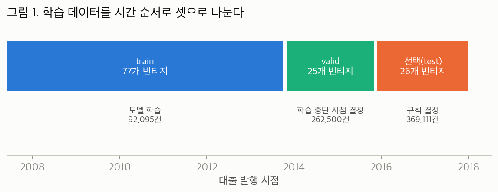
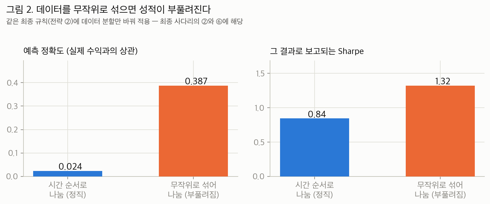
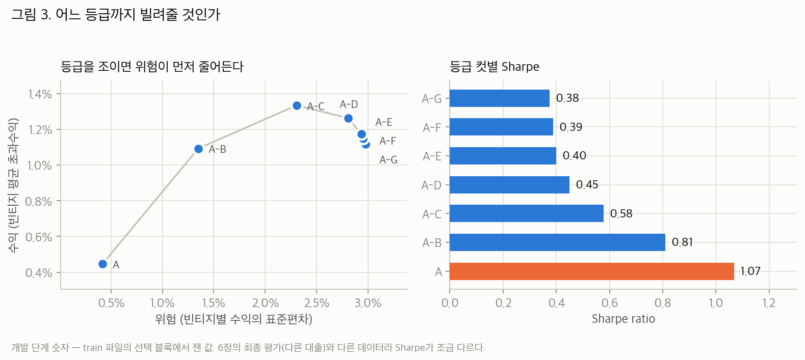
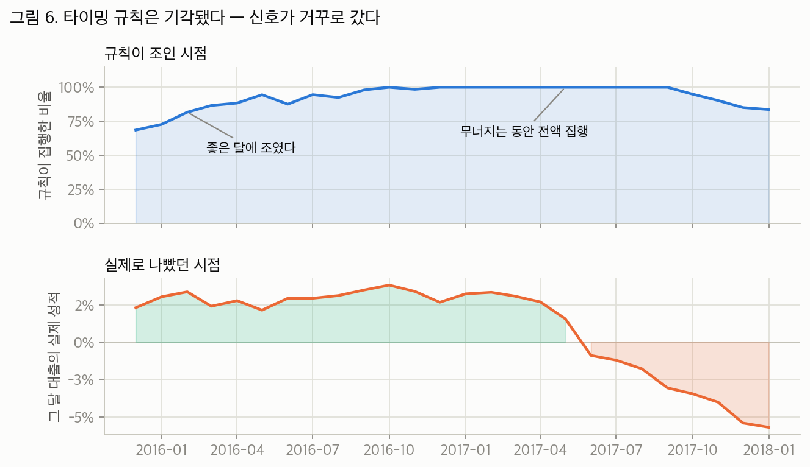
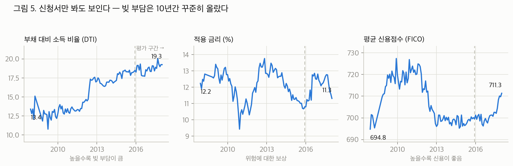
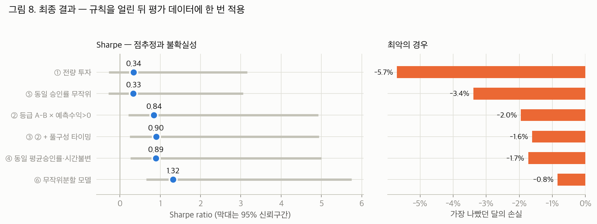
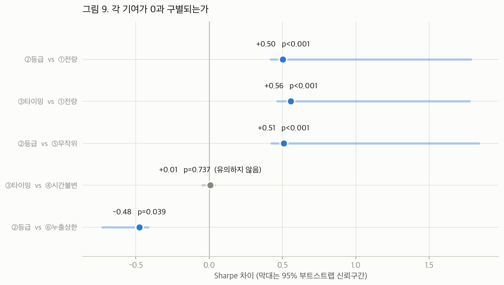

# Lending Club 대출 선별 규칙의 위험조정 성과: 시간분할 평가와 통계적 검정

제출일: 2026년 7월 30일

---

## 요약

본 보고서는 Lending Club 개인신용대출 신청 가운데 어떤 것을 승인해야 위험 대비 초과수익이 개선되는가를 다룬다. 개발용 데이터에서 모든 규칙을 확정한 뒤, 학습에 전혀 사용하지 않은 평가 데이터(36개월 만기, 2015-12~2018-01 발행, 246,009건, 빈티지 26개)에 **단 한 번** 적용하여 성과를 측정하였다.

최종 규칙은 두 단계로 구성된다: (i) 신용등급 A–B에만 승인하고, (ii) 그중 모델이 예측한 초과수익이 무위험수익률을 상회하는 건만 승인한다.

| | 자금 집행률 | 빈티지 평균 초과수익 | Sharpe | Sortino | 손실 빈티지 | 최악의 달 |
|---|---|---|---|---|---|---|
| 전량 투자 (기준) | 100% | 1.05% | 0.34 | 0.52 | 8/26 | −5.7% |
| **최종 규칙** | 57% | **1.13%** | **0.84** | 1.87 | **5/26** | **−2.0%** |

Sharpe 비율은 0.34에서 0.84로 상승하였고, 이 차이 +0.50은 정상 부트스트랩(stationary bootstrap) 기준 p<0.001로 0과 구별된다. 핵심 검정은 **승인률을 일치시킨 무작위 대조군과의 비교**이다. 동일한 57%를 무작위로 승인하면 Sharpe는 0.33에 그치므로, 성과는 승인률 축소가 아니라 **등급에 의한 선별**에서 나온다.

| 비교 | ΔSharpe | 95% 신뢰구간 | p값 | 평균 초과수익 차이 |
|---|---|---|---|---|
| 등급 선별 vs 동일 승인률 무작위 | **+0.51** | 0.42 ~ 1.85 | **<0.001** | **+0.54%p** (HAC p<0.001) |

즉 최종 규칙은 **위험을 줄이면서 동시에 수익을 늘렸으며**, 이것이 본 보고서에서 방어되는 유일한 성과 주장이다.

다만 위 p값에는 단서가 필요하다. 관측치가 26개에 불과하고 1차 자기상관이 0.956에 달해 유효표본수가 1에 미달하므로(제7장), "<0.001"은 정확한 확률이 아니라 **이 표본이 산출할 수 있는 가장 강한 수준의 증거**라는 등급으로 읽어야 한다. 블록 길이를 변경해도 결론이 뒤집히지 않음은 제7장에서 확인한다.

아울러 다음 네 가지를 미리 밝힌다.

1. **사이클 타이밍 규칙은 기각되었다.** 신청자 풀 구성으로 악화 국면을 선행 예측하여 자금을 조절하는 규칙의 기여는 +0.008(p=0.737), 예측치와 실현치의 상관은 0.034였다. 이 규칙은 성과가 가장 좋았던 시기에 자금을 축소하고 악화 국면에서 전액을 집행하였다(제5장).
2. **기계학습의 기여는 측정되지 않았다.** 시간 순서를 준수하여 학습한 모델의 예측 상관은 0.024이며, 무위험 게이트는 자금의 99.94%를 통과시킨다. 최종 규칙에서 실질적으로 작동하는 것은 Lending Club이 공시하는 등급이다.
3. **Sharpe의 절대 수준은 다중검정을 통과하지 못한다.** 총 98개 설정을 시도하였고, 무실력(zero-skill) 가정하의 최댓값 기댓값 0.645 대비 관측값 0.843의 Deflated Sharpe는 0.550으로 통상 기준 0.95에 미달한다. 따라서 "Sharpe 0.84를 달성했다"는 수준 주장은 성립하지 않으며, 방어되는 것은 대조군과의 **차이**이다.
4. **등급 컷 A–B는 선택 기준에 민감하다.** 무릎(knee) 판정 배수를 1.5·2.0배로 하면 A–B가 선택되지만 3.0배에서는 어떤 단계도 기준을 넘지 못한다. 이 기준은 λ\* 패턴을 관찰한 후 정한 것이므로 제7장에 공개한다.

---

## 목차

1. 평가 설계: 관측 단위와 지표
2. 데이터와 표본 분할
3. 시대 누출(temporal leakage)의 계량
4. 선별 규칙의 설계: 등급 컷과 무위험 게이트
5. 승인률 타이밍 규칙의 검정과 기각
6. 최종 평가: 대조군 설계와 차이 검정
7. 추론의 신뢰성: 자기상관, 다중검정, 민감도
8. 한계
9. 결론

---

## 1. 평가 설계: 관측 단위와 지표

대출 $i$의 성과는 초과수익률(excess return)로 측정한다. 총 상환액을 $R_i$, 원금을 $P_i$, 보유 기간을 $\tau_i$, 동일 시점의 국채수익률을 $r_f$라 할 때,

$$
\mathrm{ER}_i \;=\; \frac{R_i - P_i}{P_i} \;-\; r_f\,\tau_i .
$$

국채는 사실상 원금 손실이 없으므로, 신용위험을 감수한 대가가 실재했는지를 판별하는 기준선이 된다.

**관측 단위는 개별 대출이 아니라 빈티지(vintage), 즉 동일 발행월의 대출 묶음이다.** 대규모 포트폴리오에서 개별 차주의 특이위험은 상쇄되므로, 대출 단위로 계산한 변동성은 투자자가 실제로 부담하는 위험 — **발행 시점에 따라 성과가 얼마나 달라지는가** — 를 포착하지 못한다. 빈티지 $v$의 승인률을 $a_v$, 승인된 대출의 IRR을 $y_v$, 무위험수익률을 $r_{f,v}$라 하면 ([src/metrics.py](src/metrics.py); 거절된 자금은 국채로 운용된다고 가정),

$$
\mathrm{ER}_v \;=\; a_v\,(y_v - r_{f,v}), \qquad
\text{총수익률}_v \;=\; r_{f,v} + \mathrm{ER}_v ,
$$

$$
\mathrm{Sharpe} \;=\; \frac{\overline{\mathrm{ER}_v}}{s(\mathrm{ER}_v)}, \qquad
\mathrm{Sortino} \;=\; \frac{\overline{\mathrm{ER}_v}}{s^-(\mathrm{ER}_v)} .
$$

여기서 $s^-$는 하방편차이다.

이 정의에서 하나의 항등적 성질이 따라 나온다. **승인률 $a_v = a$가 시점에 대해 일정하면 분자와 분모가 같은 비율로 축소되어 Sharpe는 불변이다.** 따라서 승인 규모의 일률적 축소로는 위험조정 성과를 개선할 수 없고, (i) 승인 대상의 **구성**을 바꾸거나 (ii) 승인률을 **시점에 따라** 변화시킬 때에만 Sharpe가 움직인다. 제4장의 선별 규칙은 (i)의 경로이고, 제5장의 타이밍 규칙은 (ii)의 경로이며, 제6장의 대조군 설계는 이 성질을 직접 검증한다.

---

## 2. 데이터와 표본 분할

평가에 사용한 데이터로 규칙을 결정하면 그 성적은 선택 과정에서 발생하는 낙관 편의를 반영한다. 이를 차단하기 위해 데이터를 두 파일로 완전히 분리하였다.

- `lending_club_2020_train.csv` — 개발 전용. 모델 학습과 모든 규칙의 결정이 이 파일 안에서 완결된다.
- `lending_club_2020_test.csv` — 규칙이 모두 확정된 후 **단 한 번** 개봉하여 최종 성과만 산출한다.

개발용 파일은 다시 **발행월(빈티지) 개수 기준 6:2:2**로 시간 순서에 따라 3개 블록으로 분할하였다 ([src/split.py](src/split.py)).

- **train** — 모델 학습 구간.
- **valid** — 조기중단(early stopping) 결정 구간. XGBoost의 반복 학습은 학습 데이터에 과적합되므로, 학습에 쓰이지 않은 후행 구간에서 성능 개선이 멈추는 시점에서 중단한다.
- **선택 블록** — 등급 컷, 게이트, 타이밍 규칙을 **결정**하는 구간. 코드상 명칭은 관례에 따라 `test`이나, 최종 평가 파일과의 혼동을 피하기 위해 본 보고서에서는 선택 블록이라 칭한다. 이 블록에서는 성과를 보고하지 않고 규칙 선택만 수행한다.

분할 기준을 대출 건수가 아니라 빈티지 개수로 한 이유는, Lending Club의 물량이 후반부에 집중되어 있어 건수 기준 6:2:2로는 마지막 블록이 15개월에 불과해 Sharpe의 분모(빈티지 간 변동)를 추정할 수 없기 때문이다.



train 블록은 기간이 약 6년이나 대출은 9만 건이고, 선택 블록은 2년 남짓에 37만 건이다. 초기 Lending Club의 규모가 작았던 데 기인한다.

개발과 최종 평가 사이의 분리는 [src/pipeline.py](src/pipeline.py)에서 구조적으로 강제된다. `develop()`은 개발용 파일만 적재하여 규칙 일체를 결정·동결(freeze)한 후 반환하며, 최종 평가 단계는 동결된 규칙을 수정 없이 적용한다.

---

## 3. 시대 누출(temporal leakage)의 계량

시간 기준 분할 대신 무작위 분할을 쓰면 성과가 얼마나 부풀려지는가를 직접 측정하였다.

Lending Club의 대출 품질은 시기에 따라 크게 변동하였다. 2013년 발행분은 국채 대비 약 +10%를 벌었으나 2018년 발행분은 약 −5%였다. 무작위 분할에서는 동일 발행월의 대출이 학습과 평가 양쪽에 배분되므로, 모델은 차주의 신용위험 대신 **해당 시기의 부도율 수준을 암기**하게 된다. 발행일 변수를 투입하지 않아도 금리·FICO·부채비율의 결합분포를 통해 시기가 간접적으로 식별되므로 이 누출은 발생한다.



동일한 모델·변수·평가 대상·최종 규칙에서 분할 방식만 바꾼 결과는 다음과 같다.

- 예측 상관(예측치와 실현 수익의 상관계수): **0.024 → 0.387** (약 16배)
- 최종 Sharpe: **0.84 → 1.32**

문헌에서 보고되는 높은 성과의 상당 부분이 이 경로로 설명될 수 있다. 본 보고서는 0.024를 정직한 추정치로 보고하며, 1.32는 도달 불가능한 상한으로만 제6장의 표에 남긴다.

변수 선택에도 동일한 원칙을 적용하였다. Lending Club이 2015~2016년경부터 수집한 신용조회 관련 약 50개 항목은 그 이전 발행분에서 전부 결측이므로, 나무 모델은 결측 여부 자체를 시계(clock)로 사용할 수 있다. 이에 결측률이 시기별로 30%p 이상 변동하는 변수를 전부 제외하였다 ([src/config.py](src/config.py)의 `SAFE_FEATURE_COLS`). 조기중단 역시 후행 구간인 valid 블록으로 수행하여 학습 중단 시점의 결정에도 미래 정보가 개입하지 않도록 하였다 ([src/model.py](src/model.py)).

---

## 4. 선별 규칙의 설계: 등급 컷과 무위험 게이트

Lending Club은 자체 심사로 A(최상)부터 G(최하)까지 등급을 부여하며, 저등급일수록 표면금리가 높다. 선별 규칙은 두 요소를 결합한다.

**등급 컷.** A만, A–B, …, A–G(전량)의 7개 후보를 선택 블록에서 측정하였다.

**무위험 게이트.** 모델 예측 초과수익이 양(+)인 건만 승인한다. 국채 수익률에 미달할 것으로 예측되는 대출을 배제한다는 자명한 기준이며, **조정 모수가 없다**는 점이 중요하다. 통과율은 결과일 뿐 목표가 아니므로, 임계값을 탐색하다 우연히 유리한 설정을 채택하는 경로가 원천적으로 차단된다.

등급 컷의 선택 기준으로 "Sharpe 최대화"는 부적절하다. 등급을 조일수록 Sharpe는 단조 상승하지만, A만 승인하면 자금 집행률 24%에 평균 초과수익 0.45%로 위축된다. Sharpe는 규모에 벌점을 부과하지 않기 때문이다. 이에 평균–분산 효용

$$
U(\mu,\sigma;\lambda) \;=\; \mu \;-\; \frac{\lambda}{2}\,\sigma^2
$$

을 도입하고, 인접한 두 후보(느슨한 쪽 $L$, 엄격한 쪽 $T$)의 효용이 무차별해지는 위험회피도

$$
\lambda^* \;=\; \frac{2\,(\mu_L - \mu_T)}{\sigma_L^2 - \sigma_T^2}
$$

를 역산하였다 ([src/pipeline.py](src/pipeline.py)의 `indifference_lambda`). $\lambda^*$는 한 단계 더 조이는 데 대한 가격에 해당한다. 투자자의 $\lambda$를 추정하지 않더라도, $\lambda^*$가 급등하는 지점이 합리적 정지점이 된다.



그림 3의 수치는 개발 단계(선택 블록)에서 측정한 값이다. 제6장의 최종 평가는 동일한 달력 구간이나 완전히 다른 대출들이므로 수치가 다소 다르다(예: A–G의 Sharpe가 선택 블록 0.38, 최종 평가 0.34).

A–G에서 A–C까지는 위험(표준편차)이 3.0% → 2.3%로 감소하는 동안 평균 수익이 1.12% → 1.33%로 **오히려 증가**한다. 즉 위험이 수익보다 먼저 감소한다. 그 이후 단계부터 수익도 함께 하락한다.


$\lambda^*$의 계열은 A–G→A–F부터 순서대로 −44, −59, −24, −6, 14, 79이다. 음수는 조이면 수익이 오히려 증가함을 뜻하므로 위험 선호와 무관하게 지배적(dominant)이다 — 등급 F·G의 배제가 이에 해당한다. A–C→A–B에서 14, **A–B→A에서 79로 직전 단계의 약 6배로 급등**하므로, 정지점은 A–B이다.

한 가지를 명시한다. **무위험 게이트는 단독으로는 거의 작동하지 않는다.** 전량 투자의 Sharpe 0.3746이 게이트 적용 시 0.3754가 될 뿐인데, 모델이 자금의 99.94%를 "국채보다 우월"로 판정하기 때문이다. 게이트는 논리적으로 정당하고 조정 모수가 없다는 장점이 있으나, **성과의 실체는 등급 컷이다.**

---

## 5. 승인률 타이밍 규칙의 검정과 기각

제4장까지는 횡단면 선별("어떤 대출을 고를 것인가")이다. 그러나 그림 7(제6장)이 보여주듯 2017년 이후 빈티지는 등급을 아무리 조여도 부진하였다. 공통의 신용 사이클이 전 등급을 동반 하락시키므로, 횡단면 선별은 손실 빈티지의 **크기**를 줄일 뿐 **개수**를 줄이지 못한다. 개수를 줄이려면 시점 판단이 필요하다.

문제는 36개월 만기 대출의 성과가 3년 후에야 확정된다는 점이다. 이에 **결정 시점에 지연 없이 관측 가능한 정보**인 신청자 풀의 구성(당월 신청자의 평균 부채비율·금리·신용점수)을 사용하는 규칙을 설계하였다 ([src/timing.py](src/timing.py)).

1. **당월 기준 이미 만기가 완결된 빈티지만으로** "신청자 풀 구성 → 실현 성과"의 관계를 릿지 회귀로 추정한다.
2. 이 관계를 당월 신청자 풀 구성에 적용하여 당월 빈티지의 성과를 예측한다.
3. 예측치를 **학습 기간의 정상 수준**과 비교하여, 악화 예상 폭에 비례해 당월 승인률을 축소한다.

결정 시점 이후의 정보는 어느 단계에도 사용되지 않는다.

### 결과 — 기각

| | 값 |
|---|---|
| 타이밍 기여 (동일 평균승인률·시간불변 대조군 대비 ΔSharpe) | **+0.008** |
| 95% 신뢰구간 | −0.053 ~ 0.043 |
| p값 | **0.737** |
| 예측치와 실현 성과의 상관 | **0.034** |



규칙이 자금을 조인 시점과 실제 악화 시점이 어긋난다. 2015-12~2016-06에는 승인률을 69~88%로 축소하였으나 해당 빈티지들은 +2.2~+3.0%로 양호하였고, 2016-10~2017-09에는 100% 전액 집행하였으나 이 구간에서 성과가 +3.8%에서 −3.1%로 붕괴하였다. 축소는 2017-10 이후에야 시작되어 이미 늦었다. 요컨대 이 규칙은 **최선의 시기에 자금을 조이고 악화 국면에 전액을 투입하였다.**

### 실패의 원인

신청자 풀에서 부채비율은 10년간 상승하였으나(13.4 → 19.3), 신용점수는 개선되었고(694.8 → 711.3) 금리는 하락하였다(12.2% → 11.3%). 통상적 신용 지표는 2017년의 악화를 예고하지 않았다.



보다 근본적으로, 회귀가 학습한 것은 2007~2015년의 관계인 반면 2017년 발행분의 성과를 결정한 것은 만기가 도래하는 **2020년의 거시 상황**이며, 이 정보는 신청서에 존재하지 않는다. 명세(specification)의 수정으로 해결될 문제가 아니다.

> **재명세 기록.** 이 규칙의 최초 명세에는 오류가 있었다. 정상 수준의 기준점을 학습 기간이 아니라 평가 구간 자체의 초반부에서 구성하여, 승인률 다이얼이 26개월 중 22개월 동안 100%에 고정되어 있었다. 당시 측정된 기여 +0.048(p=0.256)은 타이밍 규칙의 검정이 아니라 사실상 아무 일도 하지 않는 규칙의 검정이었다. 기준점을 학습 기간 전체로 교정하여 규칙이 15개월에서 작동하도록 만든 후 재측정한 결과가 +0.008(p=0.737)이다. **명세를 교정하자 성과가 개선된 것이 아니라 실패가 명확해졌으며**, 이 재명세도 다중검정의 시도 횟수(98회, 제7장)에 산입하였다.

---

## 6. 최종 평가: 대조군 설계와 차이 검정

규칙 일체를 동결한 후 `lending_club_2020_test.csv`를 1회 개봉하여 적용하였다. 대상은 36개월 만기, 2015-12~2018-01 발행 246,009건, 빈티지 26개이다.


그림 7이 이하 모든 Sharpe 계산의 원자료이다. 두 계열 높이의 평균이 분자, 변동 폭이 분모이다. 2017년 중반 이후 두 계열 모두 음(−)의 영역으로 진입하나, 전량 투자는 −5.7%까지 하락하는 반면 최종 규칙은 −2.0%에서 그친다. 최종 규칙은 악화 국면을 **회피하지 못했고, 얕게 통과하였다.**

> **정오 기록.** 본 보고서의 초고는 그림 7의 파란 계열로 기각된 전략 ③(타이밍 포함, 최악의 달 −1.6%)을 "최종 규칙"의 이름으로 게재하는 오류가 있었다. 현재 그림은 실제 최종안 ②(최악의 달 −2.0%)의 계열이며, 수치가 불리해지는 방향의 교정이므로 그대로 반영하였다.

### 대조군 설계

Sharpe의 상승만으로는 그 원천을 식별할 수 없으므로 두 개의 대조군을 구성하였다 ([src/rules.py](src/rules.py), [src/pipeline.py](src/pipeline.py)).

- **⑤ 동일 승인률 무작위** — 최종 규칙과 동일한 승인률로 대출을 무작위 선택(시드 20개 평균). 승인 규모 축소 자체의 효과를 분리한다. **최종 규칙의 성과 판정 기준선이다.**
- **④ 동일 평균승인률·시간불변** — 평균 승인률은 ③과 같으나 시점 간 변동이 없다. ③과 ④의 차이가 순수한 타이밍 기여이며, 제5장의 기각 판정에 사용되었다.

### 결과



| | 집행률 | 평균 초과수익 | Sharpe | Sortino | 손실 빈티지 | 최악의 달 |
|---|---|---|---|---|---|---|
| ① 전량 투자 | 100% | 1.05% | 0.34 | 0.52 | 8/26 | −5.7% |
| ⑤ 동일 승인률 무작위 | 57% | 0.59% | **0.33** | 0.51 | 8/26 | −3.4% |
| **② 등급 A–B × 게이트 (최종)** | 57% | **1.13%** | **0.84** | **1.87** | **5/26** | **−2.0%** |
| ③ ② + 타이밍 (기각) | 53% | 1.10% | 0.90 | 2.15 | 5/26 | −1.6% |
| ④ 동일 평균승인률·시간불변 | 55% | 1.12% | 0.89 | 2.07 | 5/26 | −1.7% |
| ⑥ 무작위분할 모델 (도달불가 상한) | 53% | 1.32% | 1.32 | 5.49 | 3/26 | −0.8% |

판독 순서는 다음과 같다.

- **⑤ = 0.33.** 전량 투자(0.34)와 사실상 동일하다. 승인 규모의 축소만으로는 Sharpe가 개선되지 않으며 평균 수익만 1.05% → 0.59%로 훼손된다. 제1장의 항등성이 실증적으로 확인된다.
- **② = 0.84.** 동일 승인률에서 무작위 대신 등급으로 선별한 결과 0.33 → 0.84가 되었다. **선별의 순수 기여**이며, 본 보고서가 방어하는 유일한 성과이다.
- **③ = 0.90, ④ = 0.89.** 타이밍의 추가 기여는 시간불변 대조군 ④와의 차이로 정의되며 사실상 0이다(제5장).
- **⑥ = 1.32.** 무작위 분할에서만 도달 가능한 상한으로, 정직한 0.84는 그 64% 수준이다.

### 차이의 통계적 검정

네 개 비교 각각에 정상 부트스트랩 신뢰구간과 p값을 부여하였다. 두 계열을 **동일한 블록 인덱스로** 재추출하여 빈티지 간 대응(pairing)을 보존한다 ([src/inference.py](src/inference.py)의 `sharpe_diff_bootstrap`).



| 비교 | ΔSharpe | 95% 신뢰구간 | p값 | 차분 유효표본수 |
|---|---|---|---|---|
| 최종 규칙 vs 전량 투자 | **+0.50** | 0.41 ~ 1.79 | **<0.001** | 0.36 |
| **최종 규칙 vs 동일 승인률 무작위** | **+0.51** | 0.42 ~ 1.85 | **<0.001** | 1.10 |
| 타이밍 (③ vs ④ 시간불변) | +0.008 | −0.05 ~ 0.04 | **0.737** | 2.11 |
| 최종 규칙 vs 무작위분할 상한 | −0.48 | −0.73 ~ −0.41 | 0.039 | 1.40 |

점추정치 +0.50이 신뢰구간(0.41~1.79)의 하한 부근에 위치하는 비대칭에 유의할 필요가 있다. 부트스트랩 분포의 중위값은 0.50으로 점추정치와 일치하며, 구간을 상방으로 확장하는 것은 긴 오른쪽 꼬리이다(왜도 5.2, 재추출의 7%가 +1.0 초과). 변동성이 낮은 달들만 추출된 재표본에서 최종 규칙의 분모가 극소화되어 ΔSharpe가 상방으로 폭발하기 때문이다. 이 비대칭은 "차이가 더 클 수 있다"는 방향의 불확실성인 동시에, 분모가 이토록 쉽게 요동한다는 사실 자체가 소표본 경고이기도 하다.

**결론적으로 선별은 유의하고 타이밍은 유의하지 않다.** 선별의 기여는 부트스트랩 p<0.001이며, 평균 초과수익 자체도 무작위 대조군보다 0.54%p 높고 대응표본 HAC(Newey–West) 검정에서 p<0.001이다. 즉 등급 선별은 **위험 축소와 수익 증대를 동시에** 달성하며, "위험을 줄이기 위해 수익을 희생했다"는 반론은 성립하지 않는다. 타이밍의 기여는 신뢰구간이 0을 포함한다(p=0.737).

차분 유효표본수 열도 함께 보아야 한다. 두 전략이 동일한 26개월을 공유하므로 차분은 공통 사이클을 상쇄하지만, 그 효과는 비교마다 다르다. 무작위 대조군과의 비교는 0.36 → 1.10으로 개선되나, 전량 투자와의 비교는 두 계열이 거의 평행하게 움직여 차분에도 추세가 잔존하므로 0.36에 머문다. **차분이 항상 유효표본을 복원하는 것은 아니다.**

---

## 7. 추론의 신뢰성: 자기상관, 다중검정, 민감도

### 7.1 자기상관과 유효표본수

빈티지 초과수익 계열의 1차 자기상관은 $\rho_1 = 0.956$이다. AR(1) 근사하의 유효표본수는

$$
n_{\mathrm{eff}} \;\approx\; n\,\frac{1-\rho_1}{1+\rho_1}
\;=\; 26 \times \frac{1-0.956}{1+0.956} \;\approx\; 0.58
$$

로, **26개월 데이터의 실질 정보량이 독립 관측치 1개에 미달한다.** 신용 사이클이 완만하게 움직이므로 수년의 자료도 "사이클을 한 번 관측했다" 이상이 되지 못한다.

이 0.956에는 경기적 요인 외에 **기계적 요인**이 혼재한다. 36개월 만기 대출을 매월 발행하므로 인접 빈티지는 상환이 진행되는 36개월 중 35개월을 공유하며, 2020년의 충격은 2017년 3월과 4월 빈티지를 거의 동일한 비중으로 타격한다. 인접 빈티지의 유사성은 사이클의 지속성 때문이기도 하고 측정 창의 중첩 때문이기도 하며, 본 데이터로는 양자를 분리할 수 없다. $n_{\mathrm{eff}} = 0.58$은 두 요인을 합산한 수치로 읽어야 한다.

### 7.2 신뢰구간과 블록 길이 민감도

이 자기상관 구조 때문에 최종 규칙의 Sharpe 신뢰구간은 0.22~4.92로 매우 넓다. 구간은 평균 블록 길이 12개월의 정상 부트스트랩(Politis and Romano, 1994)으로 산출하였다. 다만 26개 관측치를 평균 12개월 블록으로 재추출하면 한 번의 재표본이 사실상 독립 블록 2개 남짓으로 구성되므로, 명목 95%의 실제 포함확률(coverage)이 보장된다고 보기 어렵다. 블록 길이 역시 연구자가 선택한 값이므로 민감도를 공개한다.

| 평균 블록 | ΔSharpe(② vs ①) 95% 구간 | p | ②의 Sharpe 95% 구간 |
|---|---|---|---|
| 6개월 | 0.40 ~ 2.84 | <0.001 | 0.14 ~ 8.92 |
| **12개월 (본문)** | 0.41 ~ 1.79 | <0.001 | 0.22 ~ 4.92 |
| 18개월 | 0.42 ~ 1.67 | <0.001 | 0.25 ~ 4.75 |

구간의 폭은 블록 길이에 따라 크게 변동한다 — 절대 수준을 확정할 수 없다는 뜻이다. 그러나 **차이의 하한이 0을 상회한다는 사실은 어떤 블록 길이에서도 변하지 않는다.** "차이는 방어되고 수준은 방어되지 않는다"는 본 보고서의 결론과 동형이다.

분포의 비정규성을 감안하여 참 Sharpe가 0보다 클 확률을 계산한 PSR(Probabilistic Sharpe Ratio; Bailey and López de Prado, 2012)은 최종 규칙에서 **0.717**로, 통상 기준 0.95에 미달한다.

### 7.3 다중검정: Deflated Sharpe

본 프로젝트는 결론에 도달하기까지 **98개 설정**을 시도하였다 — 등급 컷 7, 만기 2, 수준 재보정 3, 평가창 시작점 7, 모델 분할 3, 버킷 배분 1, 프론티어 조합 51, 현금흐름 타이밍 4, K 스윕 19, 타이밍 규칙 재명세 1. 반복 시도하에서는 무실력이라도 최댓값이 상승하므로, 그 기댓값을 기준선으로 보정한 것이 Deflated Sharpe(Bailey and López de Prado, 2014)이다.

| 항목 | 값 |
|---|---|
| 산입한 시도 횟수 | 98 |
| 시도 간 Sharpe 분산 | 0.065 |
| 무실력 가정하 기대 최고 Sharpe | **0.645** |
| 관측된 Sharpe | 0.843 |
| **Deflated Sharpe** | **0.550** |

통상 기준 0.95에 크게 미달한다. **98회 시도 끝의 0.843은 무실력으로 98회 시도했을 때 기대되는 0.645를 소폭 상회하는 수준이다.** 따라서 Sharpe의 절대 수준에 대한 주장은 기각된다.

### 7.4 사후적 선택 기준의 공개

등급 컷을 선택한 무릎 규칙 — "$\lambda^*$가 선행 단계들 중위 절대값의 2배를 초과하는 첫 지점 직전에서 정지" — 의 배수 2는 $\lambda^*$ 패턴을 관찰한 후 정한 값이다. 배수별 선택 결과는 다음과 같다.

| 배수 | 선택되는 등급 컷 |
|---|---|
| 1.5배 | A–B |
| 2.0배 | A–B |
| 3.0배 | 어떤 단계도 기준 미달 → 조이지 않음 |

1.5배와 2.0배는 동일한 답을 주지만 3.0배에서는 규칙이 무너진다. **A–B라는 결론은 이 기준에 의존한다.**

### 7.5 종합: 무엇이 방어되는가

절대 수준은 방어되지 않는다. 반면 **차이**는 두 전략이 동일한 26개월을 공유하여 공통 사이클이 상쇄되므로 사정이 다르다.

- **등급 선별의 기여 +0.51 (p<0.001)** — 방어됨. 평균 수익도 동시에 +0.54%p (p<0.001)
- **전량 투자 대비 총 개선 +0.50 (p<0.001)** — 방어됨
- **타이밍의 기여 +0.008 (p=0.737)** — 방어되지 않음. 기각
- **손실 빈티지 8/26 → 5/26, 최악의 달 −5.7% → −2.0%** — 각각 관측치 3개 차이와 1개 관측치이므로 방향성 참고로만 해석

다만 차분이 표본 문제를 해소한다고 말할 수는 없다. 제6장에서 본 대로 차분 유효표본수는 비교에 따라 0.36~2.11로 산포하며, $n=26$에서는 HAC 표준오차 자체도 불안정하다. 따라서 본 보고서의 p값은 **정확한 확률이 아니라 증거의 등급**으로 읽는 것이 타당하다.

---

## 8. 한계

1. **평가 창이 규칙 선택 창과 달력상 중첩된다.** 대출은 전혀 다르지만 기간(2015-12~2018-01)이 같다. 데이터가 2018-01에 종료되므로 후행 기간을 추가로 분리할 방법이 없다.
2. **평가 창에 신용위기가 포함되지 않는다.** 2007~2009년 위기는 본 데이터에서 전체 자금의 0.4%에 불과하며, 위기 국면 성능은 검증되지 않았다.
3. **타이밍은 본 데이터에서 실행 불가능한 것으로 판단된다.** 신청서 정보로 3년 후 만기 시점의 거시 상황을 예고할 수 없다. 명세 교정 후에도 예측 상관은 0.034였다.
4. **소표본 지표의 과신을 경계해야 한다.** Sortino의 분모(하방편차)는 음수 빈티지 5개로 추정되며, 최악의 달은 양쪽 모두 관측치 1개이다. 0.52 → 1.87과 같은 수치는 표기된 자릿수만큼의 정밀도를 갖지 않는다.
5. **기계학습의 기여는 측정되지 않았다.** 예측 상관 0.024, 게이트 통과율 99.94%. 최종 규칙에서 작동하는 것은 Lending Club 등급이다. 이는 방법의 실패가 아니라 본 데이터에 대한 결과이나, "모델을 구축하였다"고 서술할 수는 없다.
6. **60개월 만기 대출은 결론에서 제외하였다.** 2021-01 스냅샷 기준 완전만기 조건으로 인해 2016년 이후 발행분이 전부 탈락하여 2017~2018년 악화기를 포함하지 않는다. 혼합하면 계열의 구성이 중도에 변하고, 별도 분석하면 정작 중요한 구간이 부재하므로, 제외하고 사유를 명시하는 편을 택하였다.

---

## 9. 결론

본 보고서의 주장은 다음과 같이 요약된다.

**방어되는 주장.** 등급 A–B로의 선별은 동일 승인률의 무작위 선택 대비 Sharpe를 +0.51(p<0.001) 개선하며, 평균 초과수익도 +0.54%p(p<0.001) 높다. 즉 위험 축소와 수익 증대가 동시에 달성되며, 이 차이는 블록 길이 선택에 강건하다.

**방어되지 않는 주장.** (i) Sharpe 0.84라는 절대 수준 — 98회 시도의 다중검정 보정(Deflated Sharpe 0.550)과 PSR 0.717이 기준에 미달한다. (ii) 신청자 풀 기반 사이클 타이밍 — 기여 +0.008(p=0.737)로 기각되었다. (iii) 기계학습 모델의 부가가치 — 예측 상관 0.024, 게이트 통과율 99.94%로 식별되지 않았다.

최종 산출물은 정교한 예측 모델이 아니라 "등급 A–B에 투자하라"는 단순 규칙이며, 본 보고서의 기여는 그 단순한 규칙이 작동하는 이유와 **그 이상이 작동하지 않는 이유**를, 시간분할·대조군·다중검정 보정을 갖춘 설계로 계량한 데 있다.

---

## 참고문헌

- Bailey, D. H., and M. López de Prado (2012), "The Sharpe Ratio Efficient Frontier," *Journal of Risk*, 15(2), 3–44.
- Bailey, D. H., and M. López de Prado (2014), "The Deflated Sharpe Ratio: Correcting for Selection Bias, Backtest Overfitting, and Non-Normality," *Journal of Portfolio Management*, 40(5), 94–107.
- Lo, A. W. (2002), "The Statistics of Sharpe Ratios," *Financial Analysts Journal*, 58(4), 36–52.
- Newey, W. K., and K. D. West (1987), "A Simple, Positive Semi-definite, Heteroskedasticity and Autocorrelation Consistent Covariance Matrix," *Econometrica*, 55(3), 703–708.
- Politis, D. N., and J. P. Romano (1994), "The Stationary Bootstrap," *Journal of the American Statistical Association*, 89(428), 1303–1313.
- Sharpe, W. F. (1994), "The Sharpe Ratio," *Journal of Portfolio Management*, 21(1), 49–58.

---

## 부록. 재현 방법

```bash
# 1단계 개발 + 2단계 최종 평가 (결과/ 에 CSV 저장)
python -m src.pipeline

# 보고서의 모든 그림 생성 (시각화/ 에 PNG 저장)
python -m src.figures
```

| 파일 | 역할 |
|---|---|
| [src/split.py](src/split.py) | 학습 파일을 시간순 6:2:2로 분할 |
| [src/model.py](src/model.py) | XGBoost 학습·예측, valid 블록 기준 조기중단 |
| [src/cashflow.py](src/cashflow.py) | 대출별 월 현금흐름 재구성 |
| [src/metrics.py](src/metrics.py) | 빈티지 단위 수익·위험 계산 (현금 레그 포함) |
| [src/timing.py](src/timing.py) | 신청자 풀 구성 → 승인률 다이얼 (기각된 실험) |
| [src/inference.py](src/inference.py) | 정상 부트스트랩, HAC 검정, 유효표본수, PSR·DSR |
| [src/pipeline.py](src/pipeline.py) | 개발과 최종 평가의 분리, 대조군 구성 |
| [src/figures.py](src/figures.py) | 보고서 그림 9장 |
| [src/rules.py](src/rules.py) | 선별 규칙과 무작위 대조군 |
